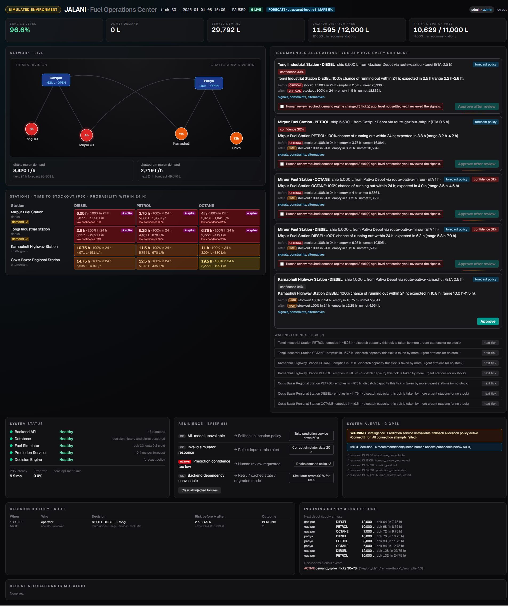
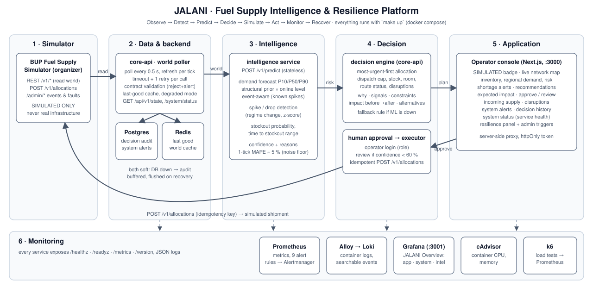

# JALANI — Fuel Supply Intelligence & Resilience Platform

> **জ্বালানি (Jalani)** = "fuel". BUP CSE FEST 2026 Hackathon Finals — *Build. Deploy. Observe. Respond.*

**⚠️ SIMULATED ENVIRONMENT.** JALANI operates only against the organizer-provided BUP Fuel
Supply Simulator. It never touches real fuel infrastructure, executes no real purchases or
dispatches, and every screen carries a **SIMULATED ENVIRONMENT** badge.

JALANI is an operations-center platform that observes the simulated fuel network, predicts
shortages, recommends explainable allocations for a human to approve, survives crises and
software failures, and proves all of it with metrics:
**Observe → Detect → Predict → Decide → Simulate → Act → Monitor → Recover.**



## What it does

| Brief | What you see |
|---|---|
| §6 Operator interface | Live network map (routes, station risk, shipments in flight), inventory and time-to-stockout per station × fuel, regional demand, shortage alerts, recommended allocations with expected impact, incoming supply, disruptions, system alerts, decision history, service health |
| §7 Intelligence | Demand forecast with P10/P50/P90, stockout probability and time-to-stockout range, abnormal-demand (spike/drop) detection, capacity-aware priority allocation. Backtest on recorded simulator data: **MAPE 4.5–5.7 %** (the noise floor) in every period vs 67 % for the documented profile alone during a ×3 spike; spikes detected on their first tick |
| §9 Decision support | Every recommendation shows **why** the station is at risk, the **signals**, the **constraints** (the binding one highlighted), **impact before → after** (stockout time, probability, unmet liters), **confidence**, and **alternatives** |
| §11 Resilience | All four failure rows implemented, visible in a Resilience panel, and triggerable with one click (admin): ML down → fallback policy; invalid simulator data → rejected + alert; low confidence → human review; dependency down → retry, cached state, degraded mode |
| §14 Observability | Prometheus + Grafana dashboard (app, system, intelligence metrics), Loki log search, 9 alert rules to Alertmanager |
| §15 Health | System Status panel: Backend API, Database, Fuel Simulator, Prediction Service, Decision Engine + p95 latency and error rate |
| §17 Load testing | k6 on the end-to-end decision API: ~140 decisions/s at the core-api CPU limit, p95 78 / 275 / 804 ms at 5 / 20 / 50 VUs, 0 errors |
| §18 Security | No hard-coded secrets (`make .env` generates them), validated input everywhere, operator/admin login: approving needs `operator`, injecting failures needs `admin` |

## Quick start

Requirements: **Docker** with the Compose v2 plugin (Docker Desktop on Windows/macOS works),
**GNU make** and **bash** (Git Bash on Windows). Everything else runs in containers.
~4 GB RAM free; images are pulled on first start.

```bash
git clone https://github.com/samir100go/Team_Charlie_Kirk_inperson_main.git jalani && cd jalani
make up            # creates .env with random secrets, builds, starts, waits until all healthy
make sim-reset     # clean simulator world: tick 0, paused
make sim-run       # start the clock (or: make demo for a slower 2 ticks/s world)
```

Without `make`: `cp .env.example .env`, fill the blank secrets, then `docker compose up -d --build --wait`.

| URL | What |
|---|---|
| http://localhost:3000 | Operator console |
| http://localhost:3001 | Grafana, "JALANI Overview" (opens without login; admin user `admin`, password `GRAFANA_ADMIN_PASSWORD` in `.env`) |
| http://localhost:8080/docs | core-api (OpenAPI); host port is `CORE_API_PORT` in `.env` |
| http://localhost:8000/admin | Simulator admin console (organizer) |
| http://localhost:9090 / :9093 | Prometheus / Alertmanager |

**Logins for the console** (passwords are generated into `.env`):
`operator` / `OPERATOR_PASSWORD` can approve allocations;
`admin` / `ADMIN_PASSWORD` can also inject failures for the resilience demo.
Viewing needs no login.

## Architecture



| Service | Port | Role |
|---|---|---|
| `simulator` | 8000 | Organizer image, unmodified |
| `core-api` (FastAPI) | 8080 | World poller + validation + cache, decision engine, approvals/executor, alerts, audit, status |
| `intelligence` (FastAPI) | 8090 | Forecast, stockout risk, anomaly detection, confidence (`/v1/predict`) |
| `web` (Next.js) | 3000 | Operator console |
| `postgres`, `redis` | – | Decision audit + system alerts; last-good world cache |
| `prometheus`, `alertmanager`, `grafana`, `loki` + `alloy`, `tempo` + `otel-collector`, `cadvisor` | 9090, 9093, 3001, 3100 | Observability |
| `k6` (profile `loadtest`) | – | Load tests |

Details: [docs/ARCHITECTURE.md](docs/ARCHITECTURE.md).

## Deployment and delivery

- **Reproducible deployment:** `docker compose` (one file, pinned image tags, health checks,
  `depends_on: service_healthy`, resource limits, named volumes). `make up` waits for health.
- **CI** (GitHub Actions, `.github/workflows/ci.yml`): ruff, mypy, pytest (96 tests),
  eslint, typecheck, prettier, gitleaks, and a Docker build of every image on every push/PR.
- **Pre-commit** hooks mirror CI (`uv run pre-commit install`).
- Source → Build → Test → Package → Deploy → Health Check → Running:
  `git push` → CI builds and tests → `make up` builds images → compose waits on health
  checks → console live. `make rollback VERSION=<tag>` restarts on an earlier image tag.

## Useful commands

```bash
make ps / make logs S=core-api      # status, logs
make test / make lint               # tests; everything CI checks
make loadtest                       # k6 at 5/20/50 VUs -> loadtest/results/
make sim-status                     # tick, events, faults
make demo-spike | demo-disrupt | demo-outage | demo-fault | demo-clear   # crises & faults
```

## Documentation

| Doc | Content |
|---|---|
| [docs/DEMO_SCRIPT.md](docs/DEMO_SCRIPT.md) | The brief's 14-step demo story with exact actions |
| [docs/ARCHITECTURE.md](docs/ARCHITECTURE.md) | Components, data flow, design decisions |
| [docs/DATA.md](docs/DATA.md) | Data used, derived data, assumptions |
| [docs/RESILIENCE.md](docs/RESILIENCE.md) | Failure handling with evidence |
| [docs/OBSERVABILITY.md](docs/OBSERVABILITY.md) | Metrics, dashboards, logs, alerts |
| [docs/LOADTEST.md](docs/LOADTEST.md) | Workload, measurements, limits |
| [docs/SIMULATOR_NOTES.md](docs/SIMULATOR_NOTES.md) | Simulator behaviour verified by experiment (21 differences from its docs) |
| [docs/REQUIREMENTS_TRACEABILITY.md](docs/REQUIREMENTS_TRACEABILITY.md) | Every §19 deliverable and §23 criterion → proof |

## License

[MIT](LICENSE)
