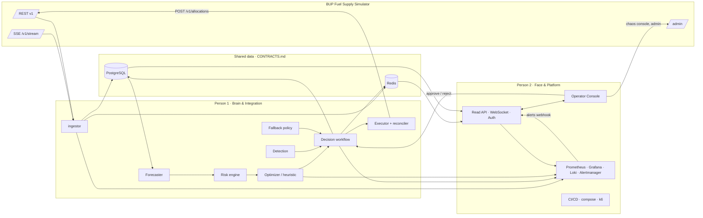

# JALANI — Fuel Supply Intelligence & Resilience Platform
### BUP CSE FEST 2026 Hackathon Finals · Build. Deploy. Observe. Respond. · **Two-person edition**

> **জ্বালানি (Jalani)** = "fuel" in Bangla. An operations-center platform that observes the BUP Fuel Supply Simulator, predicts shortages, recommends and executes explainable allocations, survives crises and software failures, and proves all of it with metrics.

---

## 0. HOW TO USE THIS FILE (read first, agent)

This file is the single source of truth for **what to build, in what order, and who builds it.** Two people work in parallel, each with their own coding agent.

| Tag | Person | Role | Owns |
|---|---|---|---|
| **[P1]** | **Person 1** (team lead) | **Brain & Integration** | Simulator client, ingestion, database, intelligence (forecast, risk, detection, optimizer), decision workflow, executor, simulator-facing resilience |
| **[P2]** | **Person 2** (teammate) | **Face & Platform** | Operator API (read models, WebSocket, auth), web console, observability stack, load testing, CI/CD, deployment, UI-facing resilience, docs site |
| **[BOTH]** | Both, together | Integration | Contracts, sync checkpoints, gates, demo |

**Operating rules for every agent**

1. **Only do tasks tagged with your person's tag or [BOTH].** Never do the other person's tasks, even if they look easy.
2. **Only edit files you own** (see §1.3). If you need a change in the other person's area, add a request to `docs/HANDOFF.md` (§1.5) and tell your human. Don't edit it yourself.
3. **Execute your phases in order.** Part A (Required) → Part B (Recommended) → Part C (Optional). Nobody starts Part B before **Gate A** passes; nobody starts Part C before **Gate B** passes.
4. **Tick only your own checkboxes** (`- [ ]` → `- [x]`). Run `git pull --rebase` before every commit to avoid conflicts on this file.
5. **Every step ends with a verification.** Run it. If it fails, fix it before moving on.
6. **Commit after every step** with Conventional Commits, prefixed with your scope (`feat(ingestor): …`, `feat(web): …`). Work on feature branches and merge through PRs (§1.4).
7. **Never modify the simulator. Never hard-code secrets. Never fake data.** Every number in the UI comes from the simulator, our models, or is explicitly labeled *mock/synthetic*.
8. **Before using any library API, look it up with the `context` MCP (Context7).** Don't rely on memory.
9. **After every UI change, verify with the `playwright` MCP** (screenshot + console check). [P2]
10. **Contracts are law.** Build against `docs/CONTRACTS.md`. To change a contract, bump its version, update the examples, and note it in `docs/HANDOFF.md` so the other side knows.
11. When the simulator differs from its docs, record it in `docs/SIMULATOR_NOTES.md` and adapt.
12. If time runs short, stop features and go to Phase 11 (docs + demo). A polished working MVP beats an unfinished masterpiece.

---

## 1. TEAM SPLIT

### 1.1 Why this split
The system has two halves that meet at a clear boundary: **the part that thinks and acts** (reads the world, predicts, decides, writes allocations) and **the part people see and operate** (API for the UI, the console, dashboards, deployment). The boundary is data in Redis/Postgres plus a few HTTP endpoints — all defined in `docs/CONTRACTS.md`. Person 2 builds against **mocks** from day one, so nobody waits.

### 1.2 Phase ownership at a glance

| Phase | Owner | Share | Notes |
|---|---|---|---|
| 0 Recon & setup | [P1] | 5% | Already in progress |
| 1 Skeleton, compose, Makefile, CI stub | [P1] finishes, [P2] takes over DevOps after | 5% | P1 is mid-way on the Docker machine; 1.7 CI and 1.8 pre-commit are [P2] now |
| **C0 Contracts v0** | **[BOTH]** | 2% | First thing both do together |
| 2 Sim client + ingestion + DB | [P1] | 12% | |
| 3 Core API read models, WebSocket, auth | [P2] | 6% | Reads what P1 writes |
| 4 Intelligence v1 | [P1] | 18% | |
| 5 Decision workflow & executor | [P1] | 10% | Includes approve/reject endpoints |
| 6 Operator console | [P2] | 15% | Starts immediately on mocks |
| 7 Resilience | [P1] backend · [P2] UI + chaos tooling + evidence | 7% | |
| 8 Observability | [P2] builds stack · [P1] adds intelligence/integration metrics | 7% | |
| 9 Load testing | [P2] | 4% | |
| 10 Tests & CI/CD | [P2] pipeline · each person tests their own code | 6% | |
| 11 Docs & architecture | [P2] leads · [P1] writes MODELS/DATA/SIMULATOR docs | 3% | |
| 12 MPC + Policy Arena | [P1] engine · [P2] Arena page | 6% | |
| 13 Scenarios, replay, experiment tracking | [P2] (P1 exposes data) | 4% | |
| 14 GenAI copilot | [P1] backend · [P2] UI drawer | 6% | |
| 15 Digital twin & what-if | [P1] twin/API · [P2] what-if UI | 5% | |
| 16 Drift & incident automation | [P1] | 3% | |
| 17 RL | [P1] | opt | |
| 18 Advanced DevOps | [P2] | opt | |
| 19 Multi-agent & event-driven | [P1] | opt | |
| 20 UI polish | [P2] | opt | |

Rough load: **P1 ≈ 55%, P2 ≈ 45%** of Part A work. P2 absorbs the UI iteration that always expands, plus the demo recording.

### 1.3 Folder ownership (avoid merge conflicts)

| Path | Owner |
|---|---|
| `services/common/` (sim client, schemas, resilience, telemetry) | [P1] |
| `services/ingestor/` | [P1] |
| `services/intelligence/`, `services/copilot/` | [P1] |
| `services/core_api/app/{workflow,executor,reconciler,fallback,decisions}` | [P1] |
| `services/core_api/app/{routers/read,ws,auth,system_status,main.py}` | [P2] |
| `services/core_api/alembic/` (DB migrations) | [P1] (P2 requests tables via HANDOFF) |
| `bench/`, `scripts/probe_simulator.py`, `scripts/sim_experiments.py` | [P1] |
| `web/` | [P2] |
| `observability/`, `loadtest/`, `.github/`, `deploy/` | [P2] |
| `scripts/chaos_demo.sh`, `scripts/deploy.sh` | [P2] |
| `scenarios/` | [P1] writes presets · [P2] consumes |
| `docs/CONTRACTS.md`, `docs/HANDOFF.md`, `project.md` | [BOTH] (small commits, pull first) |
| `docker-compose.yml`, `Makefile`, `.env.example` | [P2] after Phase 1 (P1 requests changes via HANDOFF, or makes tiny additive edits and says so) |
| `docs/MODELS.md`, `docs/DATA.md`, `docs/SIMULATOR_NOTES.md` | [P1] |
| All other `docs/` | [P2] |

### 1.4 Git workflow
- `main` = only tagged, demo-safe releases (merged at gates).
- `jalani-dev` = integration branch. Everything merges here via PR with CI green.
- Feature branches: `p1/<topic>` and `p2/<topic>`. Keep them short-lived (merge at least every few hours).
- Before starting work: `git pull --rebase origin jalani-dev`. Before pushing: run your tests.
- Never force-push `jalani-dev` or `main`.

### 1.5 Handoff queue — `docs/HANDOFF.md`
A simple running list both agents read at the start of every session:

```
## Open
- [ ] (P2→P1) Need `stations_at_risk` count in world:latest summary. Context: overview KPI. — 10:40
## Done
- [x] (P1→P2) Contracts v0.2: added `valid_until_tick` to Recommendation. — 11:15
```

### 1.6 Sync checkpoints [BOTH]
Stop, merge, and test together at each one. Agents: when you reach a checkpoint, tell your human and wait.

| # | When | What to do together | Done when |
|---|---|---|---|
| **S0** | Start (right now) | Agree on Contracts v0 (Phase C0) | `docs/CONTRACTS.md` v0 merged; P2's mock server serves every example |
| **S1** | P1 finishes Phase 2 | P2 switches Phase 3 from mocks to real Redis/Postgres | Command Center shows live simulator data |
| **S2** | P1 finishes Phase 4 | Decision Center shows real recommendations with explanations | A real ALERT card renders for a real station |
| **S3** | P1 finishes Phase 5 | End-to-end: approve in UI → allocation ARRIVED in simulator | Playwright E2E passes on both machines |
| **S4** | Phase 7 done on both sides | Joint chaos run: every row in the resilience table | `scripts/chaos_demo.sh` passes; evidence captured |
| **Gate A** | Part A complete | Full checklist, tag `v1.0.0` | All boxes ticked |
| **Gate B** | Part B complete | Tag `v1.1.0` | All boxes ticked |
| **Rehearsal** | Last 10–15% of time | Two full demo run-throughs + backup video | §11 done |

### 1.7 Starting prompts for each agent

**Person 1's agent:**
```
You are the coding agent for Person 1 (Brain & Integration) on our hackathon project. Read project.md fully (it's our plan and tracker), plus docs/HANDOFF.md, docs/CONTRACTS.md and docs/SIMULATOR_NOTES.md if they exist, and the two PDFs in docs/brief/. Do ONLY tasks tagged [P1] or [BOTH], edit ONLY files owned by P1 (section 1.3), and put any request for Person 2 in docs/HANDOFF.md. Work on p1/* branches and merge into jalani-dev by PR. Continue from where the checkboxes show we are. Stop and report to me at each sync checkpoint (section 1.6) and after each phase.
```

**Person 2's agent:**
```
You are the coding agent for Person 2 (Face & Platform) on our hackathon project. Read project.md fully (it's our plan and tracker), plus docs/HANDOFF.md and docs/CONTRACTS.md, and the two PDFs in docs/brief/. Do ONLY tasks tagged [P2] or [BOTH], edit ONLY files owned by P2 (section 1.3), and put any request for Person 1 in docs/HANDOFF.md. Work on p2/* branches and merge into jalani-dev by PR. Start with Phase C0 (contracts, together with Person 1), then build against mocks so you never wait for Person 1. Stop and report to me at each sync checkpoint (section 1.6) and after each phase.
```

---

## 2. MCP SERVERS — WHAT TO USE AND WHEN

Both machines should have these configured. Each agent checks them at session start (`/mcp`). A half-filled indicator (◐) usually means the server needs authentication or a restart.

| MCP | Mainly used by | Use it for |
|---|---|---|
| **context** (Context7) | Both | Current docs for every library before writing code against it |
| **gsap** | [P2] | Alert entrance timelines, fuel-flow particles along routes (MotionPathPlugin), crisis-mode transitions |
| **magicui** | [P2] | `NumberTicker`, `AnimatedBeam`, `BorderBeam`/`ShineBorder`, `AnimatedList`, `Marquee`, `BentoGrid`, `AnimatedCircularProgressBar`, `BlurFade` |
| **playwright** | [P2] mostly, [P1] for E2E at S3 | E2E tests, page verification, screenshots, demo rehearsal |

### 2.1 Self-connecting extra MCPs (only if they save real time)
Look up the current install command first (Context7 or the official README), add with `claude mcp add …`, reload, confirm with `/mcp`. Never commit tokens.

| Candidate | Who | Why |
|---|---|---|
| shadcn (official) | [P2] | Browse/install shadcn components accurately |
| GitHub (official) | Both | PRs, reading failed Actions logs |
| PostgreSQL (read-only DSN) | [P1] | Inspect ingestion/decision tables |
| Grafana (`mcp-grafana`) | [P2] | Verify dashboards and panels |
| Docker | Both | Inspect containers/logs |

---

## 3. WHAT WE ARE BUILDING

JALANI is an intelligent fuel operations center for a simulated Bangladeshi supply network. It **observes** the simulator in real time (REST + SSE), **detects** anomalies and emerging shortages, **predicts** demand and stockout probability per station × fuel with uncertainty bands, **decides** allocations using a constrained optimizer (with a heuristic fallback), **simulates** the expected impact of each decision, **acts** through idempotent, retry-safe allocation calls with human-in-the-loop approval for consequential decisions, **monitors** everything through Prometheus/Grafana/Loki, and **recovers** gracefully from simulator faults, crisis events and its own component failures. Every recommendation is inspectable: why the area is at risk, which signals mattered, what constraints bound, expected impact, confidence, and alternatives.

**The closed loop:** Observe → Detect → Predict → Decide → Simulate → Act → Monitor → Recover.

---

## 4. KEY FACTS FROM THE BRIEF & SIMULATOR GUIDE (both read this)

### 4.1 The world (fixed, baked into the image)
- **2 regions:** `region-dhaka` (demand_factor 1.00), `region-chattogram` (1.08)
- **2 depots:** `depot-gazipur` (Dhaka, dispatch 12,000 L/tick, cap D/P/O 90k/70k/45k, init 60k/45k/26k), `depot-patiya` (Chattogram, dispatch 11,000 L/tick, cap 85k/65k/40k, init 55k/42k/24k)
- **4 stations:** `station-mirpur` (Dhaka, urban_high), `station-tongi` (Dhaka, industrial), `station-karnaphuli` (Chattogram, highway), `station-coxsbazar` (Chattogram, regional)
- **6 routes:** 4 intra-region (2–3 transit ticks, 6,000–7,000 max_shipment) + 2 **cross-region backups** (`route-gazipur-karnaphuli`, `route-patiya-mirpur`: 4 ticks, 5,000 max) — the resilience lever when a depot or route fails.
- **3 fuels:** DIESEL, PETROL, OCTANE
- **Demand profiles** (L/sim-day, noise 8–12%) and **hour-of-day factors** are documented → structural prior for forecasting.
- **Supply:** 22 arrivals — 4 initial burst at ticks 12–20, then 18 recurring resupplies every **64 ticks** (~16 sim hours), each roughly one day of regional demand.
- Approximate daily system demand (verify in Phase 0): Diesel ≈ 41.6k L, Petrol ≈ 35.1k L, Octane ≈ 18.4k L.

### 4.2 Time
- 1 tick = 15 sim-minutes → 96 ticks = 1 sim-day.
- Default `SIMULATION_SPEED=8` ticks/s → **1 sim-day = 12 wall-clock seconds.** Decision cycles must be fast (≤ ~100 ms) and adaptive. Demos run slower (§11.4), but the system **must still work at default speed** because judges may run it that way.

### 4.3 API surface
- Reads: `/v1/health` (bypasses faults), `/v1/instance`, `/v1/regions`, `/v1/depots[/{id}]`, `/v1/stations[/{id}]`, `/v1/routes`, `/v1/supply-arrivals`, `/v1/events`, `/v1/allocations`, `/v1/demand-history?station_id=&limit=` (limit 1–2000, **grows unboundedly — we persist our own history**), `/v1/metrics`.
- **The only domain write:** `POST /v1/allocations` (+ `POST /v1/allocations/{id}/cancel` for PENDING only).
- Push: `GET /v1/stream` (SSE: `simulation.tick`, `allocation.status_changed`, `inventory.updated` (depots only), `simulator.notice`). Queue max 200 → silent drop; **no Last-Event-ID replay**; 15 s keepalive.
- Admin (bypasses faults): `/admin/run|pause|toggle|step|reset`, `/admin/events`, `/admin/faults`, `/admin/faults/clear`, `/admin/audit`.

### 4.4 Allocation rules (validation order — first failure wins)
Idempotency → NOT_FOUND(404) → ROUTE_MISMATCH → DEPOT_CLOSED → STATION_CLOSED → ROUTE_DISRUPTED → ROUTE_CAPACITY_EXCEEDED → INSUFFICIENT_INVENTORY → DISPATCH_CAPACITY_EXCEEDED → DESTINATION_CAPACITY_EXCEEDED. Lifecycle: PENDING → IN_TRANSIT (departs next tick) → ARRIVED; FAILED if route disrupted **at departure**; CANCELLED if cancelled while PENDING (inventory refunded, key stays burned).

### 4.5 Crisis events and faults
- Events: `demand_spike`, `route_disruption`, `station_outage`, `depot_constraint`, `shipment_delay` (one-shot), `supply_shortfall` (one-shot). **Scheduled events are visible in `/v1/events` before they start** → proactive planning.
- Faults on `/v1/*` (not `/admin/*`, not `/v1/health`): `latency`, `unavailable`, `error_rate`, `stale_data` (`X-Simulator-Stale: true`), `stream_disconnect`.
- Error envelopes differ: `{"detail":{"code":…}}`, `{"error":{"code":"FAULT_INJECTED"}}`, SSE fault `{"detail":{"code":"FAULT_INJECTED"}}`, Pydantic `{"detail":[…]}`. **Parse all four.**

### 4.6 Doc inconsistencies to verify in Phase 0 [P1]
- Idempotent replay status: 201 (§5.4) vs 200 (cheat sheet) → accept both.
- Are hour-of-day factors normalized?
- What happens when an arriving shipment would overflow station capacity?
- Does `CONSTRAINED` reduce dispatch capacity or only signal?
- Is demand independent of our actions?

### 4.7 Judging weights
Working Product & UX **20%** · Intelligence & Decision Quality **20%** · Architecture & Integration **15%** · DevOps & Engineering **15%** · Resilience & Incident Response **10%** · Observability & Performance **10%** · Demo & Problem Understanding **10%**.

---

## 5. ARCHITECTURE

### 5.1 Services

| Service | Owner | Port | Responsibility | Failure demo |
|---|---|---|---|---|
| `simulator` | organizer image (pinned via `SIMULATOR_IMAGE`) | 8000 | The world | Faults via `/admin/faults` |
| `simulator-bench` *(Part B)* | same image, second instance | 8001 | Benchmarks & load tests, never touches the live world | — |
| `ingestor` | [P1] | 8070 | SSE + polling, validation, persistence, snapshots | Kill → UI shows cached state + STALE |
| `core-api` | [P1] decisions · [P2] read API/WS/auth | 8080 | Operator API, decision workflow, executor, reconciliation, fallback policy | Kill → web offline mode |
| `intelligence` | [P1] | 8090 | Forecasts, risk, detection, optimizer, twin, explanations | Kill → fallback policy + human review |
| `copilot` *(Part B)* | [P1] | 8095 | LLM summaries & grounded Q&A | Kill → template explanations |
| `web` | [P2] | 3000 | Operator console (Next.js) | — |
| `postgres` | [P1] schema · [P2] container | 5432 | Time series, decisions, audit | Kill → Redis cache |
| `redis` | [P1] usage · [P2] container | 6379 | Last-known-good cache, pub/sub, streams | — |
| `prometheus`, `alertmanager`, `grafana`, `loki`, `alloy`, `otel-collector`, `tempo`/`jaeger`, `cadvisor` | [P2] | 9090 / 9093 / 3001 / 3100 / – / 4317 / 16686 / 8081 | Observability | — |
| `k6` (profile `loadtest`) | [P2] | — | Load tests | — |

### 5.2 Data flow



### 5.3 Design principles (say these in the demo)
1. **REST is truth, SSE is a hint.** Every SSE event triggers a coalesced REST refresh.
2. **Last-known-good everywhere.** Every read path has a cached fallback with an explicit staleness age.
3. **Deterministic core, probabilistic edges.** Constraints are enforced by math, never by the LLM.
4. **Human-in-the-loop by policy.** Autopilot only for low-risk, high-confidence actions.
5. **Degradation ladder:** Optimizer → Heuristic → Embedded rule policy → Hold & alert.
6. **Every decision is auditable:** inputs hash, model version, policy, constraints, expected impact, approver, outcome.

---

## 6. REPOSITORY LAYOUT (owner in brackets)

```
./
├── project.md  [BOTH]          # this file (plan + tracker)
├── README.md   [P2]
├── Makefile  docker-compose.yml  docker-compose.override.demo.yml  .env.example   [P1 now → P2 after Phase 1]
├── services/
│   ├── common/jalani_common/   [P1]  sim_client.py schemas.py resilience.py telemetry.py errors.py
│   ├── ingestor/               [P1]
│   ├── intelligence/           [P1]  forecast/ risk/ anomaly/ optimizer/ heuristic/ twin/ explain/ registry/
│   ├── copilot/                [P1]
│   └── core_api/
│       ├── app/workflow executor reconciler fallback decisions   [P1]
│       ├── app/routers/read ws auth system_status main.py        [P2]
│       └── alembic/            [P1]
├── web/                        [P2]
├── observability/              [P2]
├── loadtest/k6/                [P2]
├── scenarios/                  [P1 writes · P2 consumes]
├── bench/                      [P1]
├── deploy/                     [P2]
├── scripts/                    probe/experiments [P1] · chaos/deploy [P2]
├── docs/
│   ├── brief/                  the two organizer PDFs
│   ├── CONTRACTS.md  HANDOFF.md                         [BOTH]
│   ├── SIMULATOR_NOTES.md  MODELS.md  DATA.md           [P1]
│   ├── ARCHITECTURE.md  API.md  RESILIENCE.md  OBSERVABILITY.md  LOADTEST.md
│   │   RUNBOOK.md  SECURITY.md  DEMO_SCRIPT.md  REQUIREMENTS_TRACEABILITY.md  ADR/   [P2, P1 contributes]
└── .github/workflows/          [P2]
```

**Tooling:** Python 3.12 in containers (3.13 fine locally) + `uv`; `ruff` + `mypy`; `pytest` + `hypothesis`; Node LTS + `pnpm`; `eslint` + `tsc`; `vitest`; Playwright; k6.

---

# PART A — REQUIRED (P0). Build the complete loop first.

## Phase 0 — Recon & setup [P1] (≈5%)

- [x] 0.1 Check MCP servers. Note which are live in `docs/SIMULATOR_NOTES.md`.
- [x] 0.2 Repo setup: `.gitignore`, `LICENSE`, `README.md` stub, this file. *(GitHub MCP not connected: using the existing `origin` repo.)*
- [ ] 0.3 Start the simulator alone (`docker-compose.sim.yml`, paused). `curl localhost:8000/v1/health`.
- [ ] 0.4 Run `scripts/probe_simulator.py` → real fixtures for every endpoint in `services/common/tests/fixtures/`. *(Script + `make sim-probe` written; not yet run: waiting on Docker.)*
- [ ] 0.5 Run `scripts/sim_experiments.py` (deterministic, via `/admin/step`); record results in `docs/SIMULATOR_NOTES.md`: *(Runner + `make sim-experiments` written; not yet run.)*
  - [ ] 96 ticks, no allocations → daily demand vs profile → are hour factors normalized?
  - [ ] Idempotent replay: 200 or 201? Same key + different body → 409?
  - [ ] Overflow on arrival: what happens?
  - [ ] `depot_constraint` → does dispatch capacity change?
  - [ ] `route_disruption` with a PENDING allocation → FAILED at departure; cancel refunds inventory.
  - [ ] Every fault type: exact status codes, bodies, headers.
  - [ ] SSE cadence at speed 8; confirm no station `inventory.updated`.
  - [ ] `/admin/reset` → back to tick 0.
- [ ] 0.6 Finish `docs/SIMULATOR_NOTES.md`: confirmed behaviors, discrepancies, design implications. **Share the key findings with P2 in HANDOFF.**

**Verify:** real fixtures for all endpoints and all 5 fault types; notes answer every question in §4.6.

---

## Phase 1 — Skeleton, compose, Makefile, CI stub [P1 finishes → P2 owns after] (≈5%)

> P1 is already building this on `jalani-dev`. P1 finishes and verifies it with Docker, then hands compose/Makefile/CI ownership to P2 (note it in HANDOFF). **1.7 (CI) and 1.8 (pre-commit) are [P2] from the start** so P2 can begin right away.

- [ ] 1.1 Folder structure from §6; uv workspace with `services/common` as a local package. *(Partial: uv workspace, `services/*` with §6 subpackages, `web/`, `observability/` done. `loadtest/`, `scenarios/`, `bench/`, `deploy/`, `docs/ADR/`, `.github/` not yet.)*
- [x] 1.2 Each Python service: FastAPI app with `/healthz`, `/readyz`, `/metrics`, `/version`. *(All three run under uvicorn outside Docker; 14 tests.)*
- [ ] 1.3 Multi-stage Dockerfiles (slim, non-root, `HEALTHCHECK`). Web: Next.js standalone (P2 adds `web/Dockerfile`). *(Written: `services/python.Dockerfile` (shared) + a starter `web/Dockerfile`. uv install steps reproduced without Docker; standalone build served locally. Not yet built with Docker.)*
- [ ] 1.4 `docker-compose.yml`: all Part A services, health checks, `depends_on: service_healthy`, named volumes, resource limits, `restart: unless-stopped`, simulator image and env vars passed through. *(Written; `docker compose config` valid; promtool/amtool pass. Promtail replaced by Grafana Alloy: Promtail EOL 2026-03-02. Simulator healthcheck assumes the image has Python (unverified). Not yet run: needs Docker + `.env.example`.)*
- [ ] 1.5 `.env.example` documenting every variable; services fail fast on missing required vars.
- [ ] 1.6 `Makefile`: `up`, `up-lite`, `down`, `logs`, `ps`, `test`, `lint`, `fmt`, `e2e`, `loadtest`, `sim-reset`, `sim-run`, `sim-pause`, `sim-step N=`, `demo`, `rollback VERSION=`. *(Partial: only `sim-up`, `sim-down`, `sim-probe`, `sim-experiments`.)*
- [ ] 1.7 [P2] `.github/workflows/ci.yml` stub: lint + unit tests + docker build per service.
- [ ] 1.8 [P2] Pre-commit: ruff, mypy, eslint, prettier, gitleaks.

**Verify:** `make up` → all containers healthy; `curl localhost:8080/healthz` ok; CI green. **→ Handoff to P2.**

---

## Phase C0 — Contracts v0 [BOTH] (≈2%) — do this first, together (Sync S0)

Write `docs/CONTRACTS.md` with a **realistic JSON example for every item**. This is what lets both people work in parallel.

- [ ] C0.1 [P1] **Redis:** key `world:latest` (full current world + `meta: {tick, sim_time, is_stale, fetched_at, source}`), pub/sub channels `state.updated`, `recommendation.*`, `decision.*`, `alert.*`, `incident.*` with payloads.
- [ ] C0.2 [P1] **Postgres tables P2 may read** (names, columns, types): snapshots, demand observations, events, allocations, forecasts, risk_assessments, recommendations, decisions, incidents, system_alerts.
- [ ] C0.3 [P1] **Domain objects:** `Forecast` (P10/P50/P90 per tick), `RiskAssessment` (probability, time-to-stockout range, tier, signals), `Recommendation` (legs, expected impact before/after, explanation object, confidence, policy, model_version, valid_until_tick, status), `Decision` (audit record), `Incident`, `SystemAlert`.
- [ ] C0.4 [P1] **Decision endpoints** (served by core-api, P1-owned): `GET /api/v1/recommendations`, `POST /api/v1/recommendations/compute`, `POST /api/v1/recommendations/{id}/approve|reject|modify`, `GET /api/v1/decisions`, `POST /api/v1/whatif` (Part B), `PUT /api/v1/autopilot`.
- [ ] C0.5 [P2] **Read endpoints** (P2-owned): `/api/v1/overview`, `/network`, `/stations/{id}`, `/depots/{id}`, `/events`, `/allocations`, `/supply`, `/risks`, `/forecasts`, `/system/status`, `/version`, `/auth/login`, `/ws`; every response carries `meta`.
- [ ] C0.6 [P2] **Mock server:** web uses MSW (or a `MOCK_MODE=true` flag in core-api) serving the contract examples, so the console works with zero backend.
- [ ] C0.7 [P2] Generate TypeScript types from core-api OpenAPI (`openapi-typescript`) in CI so contract drift breaks the build.
- [x] C0.8 [BOTH] Create `docs/HANDOFF.md` from the template in §1.5.

**Verify:** both people have read and agreed to v0; the web app renders the Command Center entirely from mocks.

---

## Phase 2 — Resilient simulator client + ingestion + storage [P1] (≈12%)

### 2.1 `jalani_common.sim_client` (most important module — test it hard)
- [ ] Typed async httpx client, per-endpoint timeouts (connect 1 s, read 2 s; configurable).
- [ ] Retries with exponential backoff + full jitter (tenacity) on 503/timeout/connection errors only. Never retry 4xx except idempotent allocation replay.
- [ ] Circuit breaker per endpoint group (reads vs writes), exposed as a metric and in `/readyz`.
- [ ] Single-flight: concurrent identical GETs share one in-flight request.
- [ ] Envelope parser for all four error shapes → typed `SimulatorError(code, http_status, retryable)`.
- [ ] Validation: Pydantic v2 for every payload; required fields strict; unknown fields tolerated (logged once); unknown enum → alert + conservative handling; invalid payload → reject, store raw in `invalid_payloads`, alert, keep last-known-good.
- [ ] Stale detection via `X-Simulator-Stale`; `is_stale` on every result.
- [ ] Metrics: `jalani_sim_requests_total{endpoint,status}`, `jalani_sim_request_seconds`, `jalani_sim_circuit_state{group}`, `jalani_sim_stale_responses_total`, `jalani_sim_invalid_payloads_total`.

### 2.2 Ingestor
- [ ] Bootstrap all endpoints; backfill demand history (`limit=2000` per station).
- [ ] SSE listener (httpx-sse): `simulation.tick` → coalesced refresh; `allocation.status_changed` → upsert + REST confirm; `simulator.notice` reset → wipe derived state + re-bootstrap.
- [ ] SSE resilience: reconnect with backoff; 15 s silence is normal; watchdog on missing ticks while RUNNING → reconnect + full resync. `jalani_sse_reconnects_total`.
- [ ] Polling fallback when SSE is unavailable (`/v1/instance` every 500 ms).
- [ ] Incremental demand history per station, dedupe on `id`, tick-gap backfill.
- [ ] Per-tick JSONB world snapshot (for replay, twin calibration, backtests).
- [ ] Publish `state.updated` and write `world:latest` **exactly as in CONTRACTS.md**.
- [ ] Postgres down → keep serving Redis cache, buffer writes in a Redis Stream, flush on recovery.

### 2.3 Database (SQLAlchemy 2 async + Alembic)
- [ ] Tables from §C0.2 plus `regions, depots, stations, routes, inventory_snapshots, supply_arrivals, sim_events, sim_allocations, metrics_snapshots, world_snapshots, invalid_payloads, decision_legs, audit_log, users`. Index `(station_id, fuel, tick)`.

**Verify:** 2 sim-days at speed 8 with latency, error_rate 0.3, stale_data and stream_disconnect faults → ingestor stays up, no duplicates, no missed ticks, stale flag visible. Parser unit tests pass on every fixture. **→ Sync S1.**

---

## Phase 3 — Core API: read models, WebSocket, auth [P2] (≈6%)

Build first against mocks/fixtures; switch to real data at S1.

- [ ] `/api/v1/overview` — service level, unmet liters (total + last 24 sim-h), stations at risk, active events, open recommendations, data freshness, system status.
- [ ] `/api/v1/network` — nodes with real lat/lng for the map, routes with status, in-transit shipments.
- [ ] `/api/v1/stations/{id}`, `/api/v1/depots/{id}` — inventory by fuel, capacity, status, demand multiplier, incoming, history.
- [ ] `/api/v1/events`, `/allocations`, `/supply`, `/risks`, `/forecasts`.
- [ ] `/api/v1/system/status` — the brief's SYSTEM STATUS box: Backend API, Database, Redis, Fuel Simulator, Ingestor, Prediction Service, Decision Engine → Healthy/Degraded/Down + p95 latency + error rate (from Prometheus, cached).
- [ ] `/ws` WebSocket relaying the Redis channels; web falls back to polling if it drops.
- [ ] Every response includes `meta: {tick, sim_time, is_stale, data_age_ms, source: live|cache}`.
- [ ] Auth: JWT login; roles `viewer`, `operator`, `admin`; demo users from env (hashed). P1's decision endpoints use P2's auth dependency (`require_role("operator")`).
- [ ] Input validation, rate limiting on mutations, CORS locked to the web origin.
- [ ] `docs/API.md` (also at `/docs`).

**Verify:** contract tests against fixtures; `meta.is_stale=true` while `stale_data` fault is active.

---

## Phase 4 — Intelligence v1 [P1] (≈18%)

### 4.1 Demand forecasting (per station × fuel × tick)
- [ ] Structural prior from documented profiles × hour factor × region factor × `demand_multiplier`, calibrated with Phase 0 findings.
- [ ] Global LightGBM quantile regression (P10/P50/P90): time features, profile, multiplier, lags (t-1, t-4, t-96), rolling stats, active/scheduled event flags, prior value.
- [ ] Blend prior → learned model as history grows (document the rule).
- [ ] **No leakage:** train only on live history observed so far; never on bench data from the same seed. State this in `docs/MODELS.md`.
- [ ] Rolling-origin backtest vs seasonal-naive and prior: MAE, WAPE, P10–P90 coverage.
- [ ] Background retrain every K sim-hours; guarded promotion; registry `models/registry.json`.
- [ ] Live error tracking → `jalani_forecast_mae{horizon}`, `jalani_forecast_coverage`.

### 4.2 Stockout risk engine
- [ ] Project inventory per station × fuel over H ticks (default 32) incl. in-transit arrivals and station status.
- [ ] Monte Carlo (≈500 vectorized paths) → stockout probability, time-to-stockout (P10/P50/P90), expected unmet liters.
- [ ] Depot projection incl. committed allocations and scheduled/DELAYED supply.
- [ ] Tiers CRITICAL / HIGH / ELEVATED / NORMAL (configurable).
- [ ] Signals with contribution weights.

### 4.3 Detection
- [ ] Anomalous demand: robust z-score (median/MAD) + CUSUM.
- [ ] Abnormal inventory change vs expected Δ.
- [ ] Bottlenecks: dispatch utilization > 90%, route saturation, repeated 409s.
- [ ] Emerging regional disruption: correlated rising risk across a region.
- [ ] Each detection → `system_alerts` + `alert.*` channel + `jalani_detections_total{type}`.

### 4.4 Allocation
- [ ] Heuristic (priority, order-up-to) with route/source selection incl. cross-region backups; clamp to every constraint; split into legs.
- [ ] Optimizer v1: OR-Tools CP-SAT (100 L units), all constraints, objective = weighted shortfall + transit cost + fairness; 150 ms limit → heuristic fallback (`policy=heuristic_fallback`).
- [ ] Shared constraint validator + hypothesis property tests (no plan ever violates a constraint).

### 4.5 Impact & explanation
- [ ] Risk before → after, unmet liters avoided, stockout time shift.
- [ ] Explanation object (`why_at_risk`, `signals`, `binding_constraints`, `alternatives`, `confidence`, `policy`, `model_version`, `inputs_hash`) matching CONTRACTS.md.
- [ ] Template renderer to readable text (also the LLM fallback later).

**Verify:** backtest numbers in `docs/MODELS.md`; projection unit tests; the brief's ALERT card produced from real data. **→ Sync S2.**

---

## Phase 5 — Decision workflow, executor, reconciliation [P1] (≈10%)

- [ ] Planning loop triggered by `state.updated`, coalesced, cadence adapts to speed; immediate replan on new events/detections. `jalani_decision_cycle_seconds`.
- [ ] Recommendation lifecycle `PROPOSED → APPROVED | REJECTED | MODIFIED → EXECUTING → EXECUTED | PARTIALLY_EXECUTED | FAILED | EXPIRED` with `valid_until_tick`.
- [ ] Guardrails: autopilot only if confidence ≥ threshold, qty ≤ auto-limit, data not stale, policy ≠ fallback; otherwise human review; low confidence → always human review.
- [ ] Decision endpoints from C0.4, protected by P2's auth (`operator` role).
- [ ] Executor on a Redis Stream: idempotency key `jalani-{decision_id}-{leg_no}`; accept 200/201 replay; map every 409 code to an action (block + replan / split / defer / refresh + requantify / bug alert); 503 → backoff; circuit open → outbox, "queued – simulator unavailable".
- [ ] **Proactive protection:** route becomes (or is scheduled to become) DISRUPTED → cancel our PENDING allocations on it and reroute via backups.
- [ ] Reconciler: compare ledger with `/v1/allocations`; FAILED/missing → incident + replan; mirror `/v1/metrics` into `jalani_service_level`, `jalani_unmet_liters_total`, `jalani_allocation_failures_total`.
- [ ] Immutable decision audit with expected vs actual outcome (decision scorecard).
- [ ] Embedded fallback policy (reorder-point, no ML) when intelligence is down. `jalani_fallback_activations_total{reason}`.

**Verify:** integration test: reset → pause → demand spike → step → recommendation → approve → IN_TRANSIT → ARRIVED; service level better than no-action. **→ Sync S3 (E2E with P2).**

---

## Phase 6 — Operator Console [P2] (≈15%)

Start on day one against mocks. Use **context**, **magicui**, **gsap**, **playwright** (and the shadcn MCP if helpful).

### 6.1 Design system
- [ ] Dark ops-center theme (+ light mode); status colors CRITICAL red / HIGH orange / ELEVATED amber / NORMAL teal; distinct Diesel/Petrol/Octane colors; tabular numerals; units always shown.
- [ ] Top bar: **"SIMULATED ENVIRONMENT" badge**, sim clock + tick + RUNNING/PAUSED, freshness pill (LIVE / STALE n s / CACHED), health dot, autopilot switch, user role.
- [ ] Global degraded-mode banner from `meta` and `/system/status`.
- [ ] Motion only to direct attention; respect `prefers-reduced-motion`; never delay data.

### 6.2 Pages
1. [ ] **Command Center** (BentoGrid): KPI tiles (`NumberTicker`); offline SVG map of Bangladesh (Natural Earth GeoJSON in repo, d3-geo) with depots/stations at real coordinates, route status colors, in-transit shipments animated along routes; station × fuel risk heatmap; live event feed (`AnimatedList`); top 3 recommendations.
2. [ ] **Stations & Depots**: tank gauges per fuel, projected inventory with P10–P90 band + stockout marker + incoming arrivals, demand actual vs forecast, status history.
3. [ ] **Decision Center**: urgency-sorted queue; **Decision Card** like the brief's example, extended with confidence, signals, constraints, alternatives, policy, model version; **Approve / Modify (slider) / Reject (reason required)**; `BorderBeam` on critical cards.
4. [ ] **Events & Incidents**: timeline; each incident shows detection → evaluation → response → recovery.
5. [ ] **Decision History**: audit table, filters, expected vs actual, CSV export.
6. [ ] **System Health**: status table, p95, error rate, circuit states, fallback activity, staleness, Grafana links.
7. [ ] **Crisis Lab / Chaos Console** (admin only): run/pause/step/reset; inject any event or fault; one-click presets from `scenarios/*.json`; toggles to fail our own services via their `/chaos` endpoints.

### 6.3 Data layer
- [ ] TanStack Query + WebSocket invalidation + Zustand; polling fallback; offline mode showing cached data with its age.

**Verify (playwright):** every page loads with no console errors; screenshots in `docs/screenshots/`; layout good at 1440 px and 1920 px.

---

## Phase 7 — Application resilience (≈7%)

| Failure | Behavior | Backend [P1] | UI / tooling / evidence [P2] |
|---|---|---|---|
| Intelligence unavailable | Fallback policy, confidence capped, human review | ✔ | Banner, health row |
| Invalid simulator response | Reject, keep last-known-good, alert | ✔ | System Alerts list |
| Low prediction confidence | Human review, autopilot skips | ✔ | Card badge |
| Simulator unavailable / error_rate | Retry → breaker → cache → outbox | ✔ | Freshness pill, banner |
| Simulator latency | Timeouts, single-flight, adaptive cadence | ✔ | Grafana panel |
| Stale data | Mark stale, no autopilot | ✔ | STALE pill |
| SSE disconnect / dropped queue | Reconnect + resync, polling fallback | ✔ | Metric panel |
| Postgres down | Serve Redis, buffer writes | ✔ ingestor/decisions | ✔ read API serves Redis |
| Redis down | In-process LRU, direct DB reads | ✔ | ✔ read API |
| core-api down | Web offline mode with last snapshot | — | ✔ |
| Route disrupted with pending shipments | Cancel PENDING, reroute | ✔ | Incident timeline |
| Simulator reset | Re-bootstrap, archive run | ✔ | Notice toast |

- [ ] [P1] Implement every backend row + `/chaos` endpoints (admin-only, `CHAOS_ENABLED=true`) on ingestor, intelligence and decision workers.
- [ ] [P2] Implement every UI row + `/chaos` on the read API.
- [ ] [P2] `scripts/chaos_demo.sh`: runs each failure, waits, restores, prints what to watch.
- [ ] [P2] `docs/RESILIENCE.md` with evidence (screenshots, Grafana panels, log excerpts); P1 supplies backend explanations.

**Verify:** each row proven by a test or scripted check; stack never crashes. **→ Sync S4 (joint chaos run).**

---

## Phase 8 — Observability (≈7%)

- [ ] [P2] Stack in compose: Prometheus, Alertmanager, Grafana (provisioned as code), Loki + Grafana Alloy (Promtail is EOL), OTel collector + Tempo/Jaeger, cAdvisor.
- [ ] [P2] RED metrics for core-api and web API routes; system metrics from cAdvisor.
- [ ] [P1] Intelligence & domain metrics: `jalani_forecast_mae`, `jalani_forecast_coverage`, `jalani_model_confidence`, `jalani_shortage_alerts_total`, `jalani_decisions_total{policy,outcome}`, `jalani_fallback_activations_total`, `jalani_optimizer_solve_seconds`, `jalani_decision_cycle_seconds`, `jalani_service_level`, `jalani_unmet_liters_total`, `jalani_stations_at_risk`, `jalani_allocation_failures_total`, `jalani_sim_tick`, `jalani_data_staleness_seconds` + all integration metrics from Phase 2. **List them in CONTRACTS.md so P2 can build panels.**
- [ ] [BOTH] Logs: structlog JSON with `service, level, trace_id, correlation_id, tick, decision_id, event` (shared setup in `jalani_common.telemetry` [P1]; P2 uses it in the read API).
- [ ] [BOTH] OpenTelemetry auto-instrumentation (FastAPI, httpx, SQLAlchemy, Redis); a decision trace shows ingest → forecast → optimize → execute.
- [ ] [P2] Dashboards: `01 Service Overview (RED)`, `02 System Resources`, `03 Intelligence & Decisions`, `04 Supply Chain KPIs`, `05 Resilience & Integration`, `06 Load Test`; logs ↔ traces ↔ metrics links.
- [ ] [P2] Alert rules → Alertmanager → webhook into core-api → UI System Alerts: error rate, p95 > SLO, circuit open, stale > 30 s, fallback active, MAE drift, service level drop, CRITICAL risk, container restarts.
- [ ] [P2] SLOs in `docs/OBSERVABILITY.md`.

**Verify:** every panel shows data; one alert fires end-to-end into the UI.

---

## Phase 9 — Load testing [P2] (≈4%)

- [ ] k6: `read_path.js` (overview/network/risks, 10 → 500 VUs), `decision_path.js` (`POST /recommendations/compute`, dry-run), `e2e.js` (approve → execute against **simulator-bench** only), `under_fault.js` (read path with latency + error_rate faults).
- [ ] Output to Prometheus remote write → "Load Test" dashboard; JSON summaries in `loadtest/results/`.
- [ ] `docs/LOADTEST.md`: workload, avg/p50/p95/p99, throughput, error rate, concurrency, CPU/memory; find the knee and explain the bottleneck. Ask P1 for the decision-path explanation.
- [ ] `make loadtest`.

**Verify:** real numbers in the table + one Grafana screenshot.

---

## Phase 10 — Tests & CI/CD (≈6%)

- [ ] [P1] Unit: parser (all fixtures), retry/breaker, projection math, heuristic, optimizer property tests, idempotency keys, 409 mapping. Integration against the real simulator (`reset → pause → events → step`).
- [ ] [P2] Unit/contract tests for read API; vitest for web; Playwright E2E (login, Command Center, approve flow, kill intelligence → fallback banner → restore).
- [ ] [P2] `ci.yml`: lint + typecheck → unit → build images (buildx cache) → compose up with simulator → integration → Playwright → k6 smoke → Trivy → gitleaks; upload reports.
- [ ] [P2] `release.yml`: images to GHCR tagged `sha` + semver; changelog.
- [ ] [P2] `make deploy VERSION=x`: pull tagged images → up → wait for health checks → smoke → **auto-rollback** on failure. README shows Source → Build → Test → Package → Deploy → Health Check → Running.
- [ ] [P2] Version in UI footer and `/version`.

**Verify:** a PR shows the full pipeline green; a deliberately broken health check triggers rollback.

---

## Phase 11 — Documentation & architecture [P2 leads] (≈3%)

- [ ] [P2] `README.md`: pitch, screenshots/GIF, quick start (`cp .env.example .env && make up`), URLs, demo users, architecture image, feature list mapped to the brief.
- [ ] [P2] `docs/ARCHITECTURE.md` + `docs/architecture.svg` (mermaid-cli from §5.2): simulator → data/backend → intelligence → decision → application → monitoring.
- [ ] [P1] `docs/DATA.md` (what's from the simulator, derived, synthetic), `docs/MODELS.md`, final `docs/SIMULATOR_NOTES.md`.
- [ ] [P2] `docs/RESILIENCE.md`, `OBSERVABILITY.md`, `LOADTEST.md`, `SECURITY.md`, `RUNBOOK.md`.
- [ ] [BOTH] `docs/REQUIREMENTS_TRACEABILITY.md`: every required deliverable and criterion → proof (file/page/screenshot).
- [ ] [BOTH] `docs/ADR/`: 5–8 short decisions (each person writes the ones for their area).

---

## ✅ GATE A — Required deliverables [BOTH] (do not proceed until all pass)

- [ ] 1. Working application: `make up` from a clean clone on **both** machines → full loop works.
- [ ] 2. Source repo with setup, dependencies, deployment instructions.
- [ ] 3. Simulator integration: all reads, SSE, allocation writes.
- [ ] 4. Intelligence with backtest numbers.
- [ ] 5. Operator interface: all Phase 6 pages on live data.
- [ ] 6. Architecture diagram committed.
- [ ] 7. Reproducible deployment + CI green.
- [ ] 8. Observability evidence (dashboards, logs, alerts).
- [ ] 9. Resilience demo: ≥ 3 failure types with recovery.
- [ ] 10. Load-test evidence.
- [ ] 11. `docs/DEMO_SCRIPT.md` drafted and rehearsed once.
- [ ] Security hygiene: gitleaks clean, input validated, RBAC on sensitive actions.
- [ ] Guardrails: simulation-only, "SIMULATED" labeling, human review for consequential decisions, assumptions documented.

**Merge `jalani-dev` → `main`, tag `v1.0.0`. This is the version you can always fall back to on stage.**

---

# PART B — RECOMMENDED (P1). Make it clearly better than other teams.

## Phase 12 — MPC optimizer + Policy Arena (≈6%)
- [ ] [P1] Rolling-horizon CP-SAT/MILP over H ticks with per-tick dispatch, transit lags, projected supply, overflow and reserve; execute first period only; warm start; heuristic fallback.
- [ ] [P1] Uncertainty-aware allocation (P80 demand for high-priority stations or sampled scenarios) + "risk appetite" parameter.
- [ ] [P1] `bench/` arena against `simulator-bench`: no-action, reorder rules, heuristic, MPC (later RL) × every scenario preset; service level, unmet L, stockout-station-hours, failures, transit cost, decision latency. Results in `bench/results/` + `docs/MODELS.md`.
- [ ] [P2] `simulator-bench` service in compose; **Arena page** (comparison table + charts per scenario) reading `bench/results/` via an API endpoint P1 exposes.

## Phase 13 — Scenarios, replay, experiment tracking (≈4%)
- [ ] [P1] Scenario presets in `scenarios/` (the brief's five + combined crisis), JSON-schema validated; expose `world_snapshots` via a replay endpoint.
- [ ] [P2] Editable presets in Crisis Lab; **time machine** slider replaying map, inventories and decisions over any tick range.
- [ ] [P2] Experiment tracking UI (runs, metrics, promoted model) — MLflow container or P1's registry via API.
- [ ] [P1] Automated policy rollback: if live outcomes degrade vs a shadow heuristic for X ticks, switch policy and alert.

## Phase 14 — GenAI operations copilot (≈6%)
- [ ] [P1] Provider-agnostic LLM client (key and model from env; timeouts; latency/cost metrics).
- [ ] [P1] Decision explanations rewritten from the structured explanation only; output validated against provided ids/values; template fallback.
- [ ] [P1] Incident reports on event start/resolve; one-click shift-handover summary.
- [ ] [P1] Investigation assistant with **read-only** tools; may draft recommendations into the approval queue, never execute.
- [ ] [P1] Guardrails: sim data treated as data (prompt-injection safe), rate limit, audit every call.
- [ ] [P2] Copilot drawer UI, incident report panel, handover button, "AI-generated" labels.

## Phase 15 — Digital twin & what-if (≈5%)
- [ ] [P1] Python twin of documented dynamics; calibrate against `simulator-bench` and report fidelity (inventory MAPE).
- [ ] [P1] `POST /api/v1/whatif`: approve / different quantity / backup route / do nothing.
- [ ] [P2] What-if comparison view and live Modify slider on the Decision Card.

## Phase 16 — Drift & incident automation [P1] (≈3%)
- [ ] Page-Hinkley/ADWIN on residuals, PSI on features → alert, retrain, widen uncertainty.
- [ ] Automatic incident open/link/resolve; MTTD/MTTR metrics (P2 adds the panel).

## ✅ GATE B [BOTH]
- [ ] Arena shows MPC ≥ heuristic ≥ rules on most scenarios (or an honest explanation).
- [ ] Copilot works and degrades to templates when the LLM is off.
- [ ] Replay and what-if work in the UI.
- [ ] All Gate A items still pass. Tag `v1.1.0`.

---

# PART C — OPTIONAL ADVANCED (P2 tier). Only if it adds real value and time allows.

## Phase 17 — Reinforcement learning [P1]
- [ ] Gymnasium env on the twin; PPO (stable-baselines3) with domain randomization.
- [ ] Safe hybrid: RL picks target cover levels; the validator/optimizer turns them into feasible allocations.
- [ ] Compare honestly in the Arena; keep MPC as default if RL doesn't beat it.

## Phase 18 — Advanced DevOps [P2]
- [ ] kind + Helm chart; HPA for core-api and intelligence; Argo Rollouts canary with Prometheus analysis and automated rollback; Argo CD GitOps; Terraform for the cluster and releases.
- [ ] Docker compose stays the primary, judge-friendly path.

## Phase 19 — Multi-agent & event-driven [P1]
- [ ] Regional planner agents + coordinator resolving depot contention through the optimizer (only if meaningful).
- [ ] Full Redis Streams pipeline with consumer groups, retries, dead-letter stream (P2 adds a DLQ view).

## Phase 20 — UI polish [P2]
- [ ] GSAP crisis-mode transition and "all clear" recovery animation.
- [ ] Magic UI `Marquee` ticker, `BorderBeam` on active incident, `BlurFade` transitions.
- [ ] Operator keyboard shortcuts (A approve, R reject, J/K navigate).
- [ ] Bangla/English toggle for key labels.
- [ ] Lighthouse ≥ 90 on Command Center; no layout shift on live updates.

---

## 11. DEMO [BOTH]

### 11.1 Demo script (`docs/DEMO_SCRIPT.md`) — the brief's 14 steps
**Driver** (hands on keyboard) = P2 · **Narrator** (explains intelligence and decisions) = P1. Swap for the failure section if you prefer: P2 narrates observability and resilience.

| # | Brief step | What we show | Where | Narrator |
|---|---|---|---|---|
| 1 | Normal operations | Sim RUNNING, all green | Command Center | P1 |
| 2 | Operator dashboard | Map flows, KPIs, health | Command Center | P2 |
| 3 | Demand increases | Dhaka demand spike ×1.8 | Crisis Lab | P1 |
| 4 | System detects risk | Anomaly alert, heatmap turns red | Command Center | P1 |
| 5 | Shortage predicted | Stockout time, probability, P10–P90 band | Station page | P1 |
| 6 | Recommendation | Decision Card, risk before → after | Decision Center | P1 |
| 7 | Operator inspects | Signals, constraints, alternatives, what-if, copilot | Decision Center | P1 |
| 8 | Allocation executed | Approve → PENDING → IN_TRANSIT on map | Map | P2 |
| 9 | Crisis event | Route disruption + shipment delay | Crisis Lab | P1 |
| 10 | System adapts | Cancel PENDING, reroute via backup | Incident timeline | P1 |
| 11 | Failure injected | Simulator error_rate + kill intelligence | Chaos Console | P2 |
| 12 | Monitoring detects | Alert fires, Grafana spike, Degraded status | Health + Grafana | P2 |
| 13 | Fallback activates | Cached state, STALE pill, rule-based fallback | Banner | P2 |
| 14 | Operations continue | Restore, circuit closes, service level recovers | Command Center | P2 |
| + | Proof | Arena, load-test numbers, CI pipeline, traceability | Arena / docs | Both |

### 11.2 Timing
7–8 minutes live + 2 minutes buffer. One narration sentence per step, tied to a judging criterion.

### 11.3 Backup plan [P2]
- [ ] Recorded demo video + GIFs in `docs/demo/` (Playwright).
- [ ] `make demo` = clean reset + seed + preset timeline.
- [ ] Pre-pulled images; works **offline** (no map tiles, no CDN, LLM optional).

### 11.4 Demo speed
`docker-compose.override.demo.yml` sets `SIMULATION_SPEED=1` or `2`; show once that it also works at 8. Pause/step controls in the top bar.

### 11.5 Rehearse
- [ ] [P2] `e2e/demo.spec.ts` scripts the whole flow; run before going on stage.
- [ ] [BOTH] Two full live run-throughs, timed.

---

## 12. SURPRISE-EVENT PLAYBOOK

When organizers announce a change:
1. **[BOTH]** Read it; decide in 2 minutes whose area it hits; note it in HANDOFF.
2. **[P1]** Probe with `scripts/probe_simulator.py`, refresh fixtures, run contract tests → they show exactly what changed. Update `SIMULATOR_NOTES.md`.
3. **New event type / enum?** [P1] explicit handling + scenario preset + test · [P2] show it in the UI and Crisis Lab.
4. **New endpoint / field?** [P1] schema + ingestion + CONTRACTS bump · [P2] surface it if operators need it.
5. **New simulator image?** [P2] bump `SIMULATOR_IMAGE`, run CI.
6. **New constraint / rule?** [P1] constraint validator first, then optimizer.
7. **Engineering event** ("your DB dies", "double the load")? [P2] run the matching chaos/load scenario and capture Grafana evidence · [P1] fix backend behavior if needed.
8. [P2] Tag `v1.x.y`, `make deploy`, and [BOTH] rehearse the affected demo step.

Thresholds, weights, horizons, cadences and feature flags live in config (env + `config/*.yaml`) so most changes need no code change.

---

## 13. TIME BUDGET

| Tier | Phases | Share of time | Rule |
|---|---|---|---|
| **P0 Required** | 0–11 + C0 | ~70% | Complete and stable before anything else |
| **P1 Recommended** | 12–16 | ~20% | Biggest score multipliers |
| **P2 Optional** | 17–20 | ~10% | Only what improves the demo |

- Reserve the **last 10–15%** of hackathon time for freeze → rehearsal → fixes → backup video. No new features then.
- If one person finishes their Part A early, they **don't start Part B alone**. They help close Gate A (tests, docs, evidence, demo script) so the gate passes sooner.
- If one person is blocked, they switch to their next unblocked task and log the blocker in HANDOFF.

---

## 14. DEFINITION OF DONE (per feature)
- Works in `docker compose up` from a clean clone.
- Has tests (unit, plus integration where it touches the simulator).
- Emits metrics and structured logs; failures visible in Grafana.
- Degrades gracefully when its dependencies fail.
- Matches `docs/CONTRACTS.md` (or bumps it and notes the change in HANDOFF).
- Documented and traced in `REQUIREMENTS_TRACEABILITY.md`.
- UI parts verified with Playwright, screenshot saved.
- Your checkbox ticked in this file and committed.

---

> **"Your job is not only to build the system. Your job is to keep it working."**
> Build the loop. Prove the intelligence with numbers. Break it on purpose. Show it recover.
