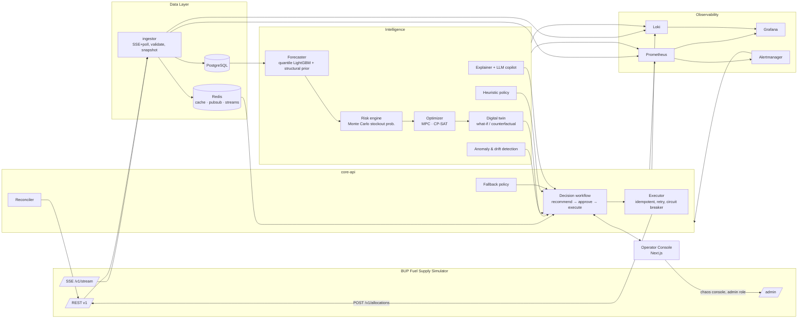

# JALANI — Fuel Supply Intelligence & Resilience Platform
### BUP CSE FEST 2026 Hackathon Finals · Build. Deploy. Observe. Respond.

> **জ্বালানি (Jalani)** = "fuel" in Bangla. An operations-center platform that observes the BUP Fuel Supply Simulator, predicts shortages, recommends and executes explainable allocations, survives crises and software failures, and proves all of it with metrics.

---

## 0. HOW TO USE THIS FILE (read first, agent)

You are the **lead engineer** of this project. This file is the single source of truth for what to build and in what order.

**Operating rules**

1. **Execute phases strictly in order.** Part A (Required) → Part B (Recommended) → Part C (Optional/Advanced). Never start Part B before the **Gate A** checklist passes. Never start Part C before **Gate B** passes.
2. **Tick the checkboxes in this file** (`- [ ]` → `- [x]`) as you complete each task, and commit the file with the work. This file is the progress tracker judges and teammates can read.
3. **Every step ends with a verification.** Run the listed verify commands. If a verify fails, fix it before moving on.
4. **Commit after every step** using Conventional Commits (`feat(api): …`, `fix(ingestor): …`, `chore(ci): …`). Push often. Keep `main` green.
5. **Never modify the simulator.** Never hard-code secrets. Never fake data: every number in the UI comes from the simulator, from our models, or is explicitly labeled *synthetic/derived*.
6. **Before using any library API, look it up with the `context` MCP (Context7)** so the code matches current versions. Do not rely on memory for library APIs.
7. **After every UI change, verify it with the `playwright` MCP** (open the page, take a screenshot, check the console for errors).
8. **Always keep `docker compose up` working.** A broken stack is worse than a missing feature.
9. When the simulator behaves differently from its docs, **record it in `docs/SIMULATOR_NOTES.md`** and adapt the code — do not argue with the world.
10. If time is running short, **stop adding features and go to Phase 11 (docs + demo)**. A polished, working MVP beats an unfinished masterpiece.

---

## 1. MCP SERVERS — WHAT TO USE AND WHEN

The team already has these MCP servers configured. Check them first (`/mcp` in Claude Code). A half-filled indicator (◐) usually means the server needs authentication or a restart — fix that before starting.

| MCP | Use it for | When |
|---|---|---|
| **context** (Context7) | Up-to-date docs & code examples for FastAPI, Pydantic v2, SQLAlchemy 2, httpx, tenacity, OR-Tools, LightGBM, Next.js, TanStack Query, shadcn/ui, Recharts, Prometheus, Grafana provisioning, Loki, OpenTelemetry, k6, GitHub Actions, Helm, Argo Rollouts | Before writing code against any library. Every phase. |
| **gsap** | Animation patterns: alert entrance timelines, fuel-flow particles along routes (MotionPathPlugin), crisis-mode transitions, number morphs | Phase 6 and Phase 18 |
| **magicui** | Polished components: `NumberTicker` (KPIs), `AnimatedBeam` (depot→station flows), `BorderBeam` / `ShineBorder` (critical alert cards), `AnimatedList` (live event feed), `Marquee` (event ticker), `BentoGrid` (command center layout), `AnimatedCircularProgressBar` (tank levels), `BlurFade` (page transitions) | Phase 6 and Phase 18 |
| **playwright** | E2E tests, visual verification of every page, screenshot evidence for docs, scripted demo rehearsal | Phase 6 onward, Phase 10, Phase 19 |

### 1.1 Self-connecting additional MCPs (only if they help)

If a task would clearly benefit from an MCP that is not connected, add it yourself. **Always look up the current install command first** (Context7 or the project's official README — commands change), add it with `claude mcp add …`, reload, and confirm it with `/mcp`. Never commit tokens; pass them via environment variables.

| Candidate MCP | Why | Phase |
|---|---|---|
| **shadcn** (official shadcn/ui MCP) | Browse/install shadcn components & blocks accurately | 6 |
| **GitHub** (official GitHub MCP) | Create repo, issues, PRs, read Actions run logs when CI fails | 1, 10 |
| **PostgreSQL** (read-only DSN) | Inspect tables while debugging ingestion and decisions | 2–5 |
| **Grafana** (`mcp-grafana`) | Query dashboards/Prometheus/Loki, verify panels render data | 8 |
| **Docker** | Inspect containers/logs when compose misbehaves | any |

Rule: *do not add an MCP "just because".* Add it when it saves real time.

### 1.2 Parallel work (if running multiple agents / teammates)

After Phase 2 lands, backend (Phases 3–5), frontend (Phase 6) and observability (Phase 8) can proceed in parallel against the API contract in `docs/API.md`. Use separate branches / worktrees and merge through PRs with CI green.

---

## 2. WHAT WE ARE BUILDING (one-paragraph pitch)

JALANI is an intelligent fuel operations center for a simulated Bangladeshi supply network. It **observes** the simulator in real time (REST + SSE), **detects** anomalies and emerging shortages, **predicts** demand and stockout probability per station × fuel with uncertainty bands, **decides** allocations using a constrained optimizer (with a heuristic fallback), **simulates** the expected impact of each decision on a calibrated digital twin, **acts** through idempotent, retry-safe allocation calls with human-in-the-loop approval for consequential decisions, **monitors** everything through Prometheus/Grafana/Loki, and **recovers** gracefully from simulator faults, crisis events and its own component failures. Every recommendation is inspectable: why the area is at risk, which signals mattered, what constraints bound, expected impact, confidence, and alternatives.

**The closed loop we demonstrate:** Observe → Detect → Predict → Decide → Simulate → Act → Monitor → Recover.

---

## 3. KEY FACTS FROM THE BRIEF & SIMULATOR GUIDE (encode these, don't rediscover them)

### 3.1 The world (fixed, baked into the image)
- **2 regions:** `region-dhaka` (demand_factor 1.00), `region-chattogram` (1.08)
- **2 depots:** `depot-gazipur` (Dhaka, dispatch 12,000 L/tick, cap D/P/O 90k/70k/45k, init 60k/45k/26k), `depot-patiya` (Chattogram, dispatch 11,000 L/tick, cap 85k/65k/40k, init 55k/42k/24k)
- **4 stations:** `station-mirpur` (Dhaka, urban_high), `station-tongi` (Dhaka, industrial), `station-karnaphuli` (Chattogram, highway), `station-coxsbazar` (Chattogram, regional)
- **6 routes:** 4 intra-region (2–3 transit ticks, 6,000–7,000 max_shipment) + 2 **cross-region backups** (`route-gazipur-karnaphuli`, `route-patiya-mirpur`: 4 ticks, 5,000 max) — these are the resilience lever when a depot or route fails.
- **3 fuels:** DIESEL, PETROL, OCTANE
- **Demand profiles** (L/sim-day, noise 8–12%) and **hour-of-day factors** are documented → build a *structural prior* from them.
- **Supply:** 22 arrivals — 4 initial burst at ticks 12–20, then 18 recurring resupplies every **64 ticks** (~16 sim hours), each roughly one day of regional demand.
- Approximate daily system demand (verify in Phase 0): Diesel ≈ 41.6k L, Petrol ≈ 35.1k L, Octane ≈ 18.4k L.

### 3.2 Time
- 1 tick = 15 sim-minutes by default → 96 ticks = 1 sim-day.
- Default `SIMULATION_SPEED=8` ticks/s → **1 sim-day passes in 12 wall-clock seconds.** The decision loop must be fast (budget ≤ ~100 ms per cycle) and adaptive. For demos we run slower (see §9.4), but the system **must still work at the default speed** because judges may run it that way.

### 3.3 API surface
- Reads: `/v1/health` (bypasses faults), `/v1/instance`, `/v1/regions`, `/v1/depots[/{id}]`, `/v1/stations[/{id}]`, `/v1/routes`, `/v1/supply-arrivals`, `/v1/events`, `/v1/allocations`, `/v1/demand-history?station_id=&limit=` (limit 1–2000, **grows unboundedly — we must persist our own history**), `/v1/metrics`.
- **The only domain write:** `POST /v1/allocations` (+ `POST /v1/allocations/{id}/cancel` for PENDING only).
- Push: `GET /v1/stream` (SSE: `simulation.tick`, `allocation.status_changed`, `inventory.updated` (depots only), `simulator.notice`). Queue max 200 → silent drop; **no Last-Event-ID replay**; 15 s keepalive.
- Admin (bypasses faults): `/admin/run|pause|toggle|step|reset`, `/admin/events` (inject crises), `/admin/faults` (inject faults), `/admin/faults/clear`, `/admin/audit`.

### 3.4 Allocation rules (validation order — first failure wins)
Idempotency → NOT_FOUND(404) → ROUTE_MISMATCH → DEPOT_CLOSED → STATION_CLOSED → ROUTE_DISRUPTED → ROUTE_CAPACITY_EXCEEDED → INSUFFICIENT_INVENTORY → DISPATCH_CAPACITY_EXCEEDED (in-flight+pending from depot this tick + qty > dispatch cap) → DESTINATION_CAPACITY_EXCEEDED (station inv + qty > station cap). Lifecycle: PENDING → IN_TRANSIT (departs next tick) → ARRIVED; FAILED if route disrupted **at departure**; CANCELLED if cancelled while PENDING (inventory refunded, key stays burned).

### 3.5 Crisis events (via `/admin/events`) and faults (via `/admin/faults`)
- Events: `demand_spike` (multiplies station `demand_multiplier`), `route_disruption`, `station_outage`, `depot_constraint`, `shipment_delay` (one-shot, not undone), `supply_shortfall` (one-shot). **Scheduled events are visible in `/v1/events` before they start** → proactive planning opportunity.
- Faults on `/v1/*` (not `/admin/*`, not `/v1/health`): `latency`, `unavailable` (503), `error_rate` (random 503), `stale_data` (`X-Simulator-Stale: true` header), `stream_disconnect` (SSE 503).
- Error envelopes differ: domain errors `{"detail":{"code":…}}`, faults `{"error":{"code":"FAULT_INJECTED"}}`, SSE fault `{"detail":{"code":"FAULT_INJECTED"}}`, Pydantic `{"detail":[…]}`. **Parse all four.**

### 3.6 Doc inconsistencies to verify in Phase 0 (don't assume)
- Idempotent replay status: §5.4 says **201**, cheat sheet says **200** → accept both.
- Whether hour-of-day factors are normalized (does daily total match the profile table?).
- What happens when an arriving shipment would overflow station capacity (the API check uses *current* inventory only).
- Whether `CONSTRAINED` depots actually get reduced dispatch capacity or it's only a signal.
- Whether demand is independent of our actions (expected: yes; served/unmet depend on inventory).

### 3.7 Judging weights (optimize for these)
Working Product & UX **20%** · Intelligence & Decision Quality **20%** · Architecture & Integration **15%** · DevOps & Engineering **15%** · Resilience & Incident Response **10%** · Observability & Performance **10%** · Demo & Problem Understanding **10%**.

---

## 4. ARCHITECTURE

### 4.1 Services

| Service | Tech | Port | Responsibility | Failure boundary demo |
|---|---|---|---|---|
| `simulator` | organizer image `asifmahmoud414/bup-fuel-supply-simulator:1.0.0` (pinned via `SIMULATOR_IMAGE`) | 8000 | The world | Inject faults via `/admin/faults` |
| `simulator-bench` *(Part B)* | same image, second instance | 8001 | Isolated sandbox for policy benchmarks & load tests (never touches the live world) | — |
| `ingestor` | Python 3.12, asyncio, httpx, httpx-sse | 8070 | SSE + REST polling, validation, persistence, tick snapshots, change events | Kill it → UI shows cached state + STALE banner |
| `core-api` | FastAPI | 8080 | Operator API, decision workflow, executor, reconciliation, RBAC, WebSocket push, embedded fallback policy | Kill it → web shows offline mode with last snapshot |
| `intelligence` | FastAPI + LightGBM + OR-Tools + NumPy | 8090 | Forecasts, stockout probability, anomaly detection, optimizer, twin/what-if, explanations | Kill it → core-api switches to fallback policy, confidence ↓, human review required |
| `copilot` *(Part C, can live inside intelligence)* | FastAPI + LLM API | 8095 | Incident summaries, grounded Q&A, handover reports | Kill it → template explanations |
| `web` | Next.js (App Router) + TypeScript + Tailwind + shadcn/ui + Magic UI + GSAP | 3000 | Operator console | — |
| `postgres` | PostgreSQL 16 (TimescaleDB optional) | 5432 | Time series, decisions, audit | Kill it → ingestor buffers in Redis, API serves Redis cache |
| `redis` | Redis 7 | 6379 | Cache (last-known-good state), pub/sub, Redis Streams work queues, locks | — |
| `prometheus` | | 9090 | Metrics | — |
| `alertmanager` | | 9093 | Alert routing → webhook into core-api (alerts appear in UI) | — |
| `grafana` | provisioned dashboards | 3001 | Dashboards | — |
| `loki` + `promtail` | | 3100 | Structured logs | — |
| `tempo` or `jaeger` + `otel-collector` | | 16686 / 4317 | Traces (optional but cheap) | — |
| `cadvisor` | | 8081 | Container CPU/memory | — |
| `k6` *(profile `loadtest`)* | | — | Load tests | — |

### 4.2 Data flow



### 4.3 Design principles (say these in the demo)
1. **REST is truth, SSE is a hint.** Every SSE event triggers a (coalesced) REST refresh.
2. **Last-known-good everywhere.** Every read path has a cached fallback with an explicit staleness age.
3. **Deterministic core, probabilistic edges.** Constraints are enforced by math (optimizer + validators), never by the LLM.
4. **Human-in-the-loop by policy, not by accident.** Autopilot only for low-risk, high-confidence actions; everything else needs approval.
5. **Graceful degradation ladder:** Optimizer → Heuristic → Embedded rule policy → Hold & alert.
6. **Every decision is an auditable record:** inputs snapshot hash, model version, policy, constraints, expected impact, approver, outcome.

---

## 5. REPOSITORY LAYOUT

```
jalani/
├── project.md                      # this file (progress tracker)
├── README.md                       # quick start, screenshots, architecture
├── Makefile                        # up, down, logs, test, lint, seed, demo, loadtest, reset-sim
├── docker-compose.yml              # full stack (app + observability)
├── docker-compose.override.demo.yml# demo speed, demo users
├── .env.example                    # every config var documented, no secrets
├── services/
│   ├── common/                     # shared python pkg: sim client, schemas, telemetry, resilience
│   │   └── jalani_common/
│   │       ├── sim_client.py       # typed, resilient simulator client
│   │       ├── schemas.py          # Pydantic models for every sim payload
│   │       ├── resilience.py       # retry, circuit breaker, timeouts, single-flight
│   │       ├── telemetry.py        # structlog, prometheus, OTel setup
│   │       └── errors.py           # envelope parsing (detail/error/pydantic)
│   ├── ingestor/
│   ├── core_api/
│   │   ├── app/{routers,services,workflow,executor,reconciler,fallback,auth,ws}
│   │   └── alembic/
│   ├── intelligence/
│   │   ├── app/{forecast,risk,anomaly,optimizer,heuristic,twin,explain,registry}
│   │   └── models/                 # versioned model artifacts (gitignored except metadata)
│   └── copilot/
├── web/                            # Next.js app
├── observability/
│   ├── prometheus/{prometheus.yml,alerts.yml}
│   ├── alertmanager/alertmanager.yml
│   ├── grafana/{provisioning,dashboards/*.json}
│   ├── loki/ promtail/ tempo/ otel-collector/
├── loadtest/k6/{read_path.js,decision_path.js,e2e.js,under_fault.js}
├── scenarios/                      # crisis presets (JSON) used by UI Crisis Lab, tests, demo
├── bench/                          # policy arena harness
├── deploy/                         # (Part C) helm/, k8s/, terraform/, argocd/
├── docs/
│   ├── ARCHITECTURE.md  architecture.svg/png
│   ├── API.md  SIMULATOR_NOTES.md  DATA.md  MODELS.md
│   ├── RESILIENCE.md  OBSERVABILITY.md  LOADTEST.md
│   ├── RUNBOOK.md  SECURITY.md  DEMO_SCRIPT.md
│   ├── REQUIREMENTS_TRACEABILITY.md
│   └── ADR/                        # short architecture decision records
└── .github/workflows/{ci.yml,release.yml,deploy.yml}
```

**Tooling:** Python 3.12 + `uv`; `ruff` + `mypy`; `pytest` + `hypothesis`; Node current LTS + `pnpm`; `eslint` + `tsc`; `vitest`; Playwright; k6.

---

# PART A — REQUIRED (P0). Build the complete loop first.

## Phase 0 — Recon & setup (≈5% of time)

**Goal:** Know exactly how the simulator behaves before writing product code.

- [x] 0.1 Check MCP servers (`/mcp`). Fix any that need auth. Note which are live in `docs/SIMULATOR_NOTES.md` header.
- [x] 0.2 Create repo `jalani` (GitHub MCP if connected), add `.gitignore`, `LICENSE`, `README.md` stub, this `project.md`. *(GitHub MCP not connected: using the existing `origin` repo.)*
- [ ] 0.3 Start the simulator alone with the organizer compose snippet (`SIMULATOR_START_MODE=paused`). `curl localhost:8000/v1/health`.
- [ ] 0.4 Write `scripts/probe_simulator.py` that calls **every** endpoint and saves responses to `services/common/tests/fixtures/*.json` (these become contract-test fixtures).
- [ ] 0.5 Deterministic experiments using `/admin/step` (record results in `docs/SIMULATOR_NOTES.md`):
  - [ ] Step 96 ticks with no allocations; compute per-station daily demand vs documented profile → are hour factors normalized?
  - [ ] Create an allocation, replay same key+body → 200 or 201? Same key, different body → 409?
  - [ ] Allocation that would overflow on arrival (inventory near cap + in-transit) → what happens at arrival?
  - [ ] Inject `depot_constraint` → does dispatch capacity change?
  - [ ] Inject `route_disruption` on a route with a PENDING allocation → confirm it FAILS at departure; confirm cancel refunds inventory.
  - [ ] Inject each fault type; capture exact status codes, bodies, headers.
  - [ ] Connect to SSE; record event cadence at speed 8; confirm no `inventory.updated` for stations.
  - [ ] `/admin/reset` → confirm the world returns to tick 0.
- [ ] 0.6 Write `docs/SIMULATOR_NOTES.md`: confirmed behaviors, doc discrepancies, implications for our design.

**Verify:** fixtures exist for all endpoints and all 5 fault types; notes answer every question in §3.6.

---

## Phase 1 — Skeleton, compose, Makefile, CI stub (≈5%)

- [ ] 1.1 Create folder structure from §5. Python services share `services/common` as a local package (uv workspace).
- [ ] 1.2 Each Python service: FastAPI app with `/healthz` (liveness) and `/readyz` (readiness: checks its dependencies), `/metrics`, `/version` (git SHA, build time, image tag, model version).
- [ ] 1.3 Multi-stage Dockerfiles (slim, non-root user, `HEALTHCHECK`). Web: Next.js standalone output.
- [ ] 1.4 `docker-compose.yml` with **all** services from §4.1 (Part A ones), health checks, `depends_on: condition: service_healthy`, named volumes, one network, resource limits, `restart: unless-stopped`. Simulator image pinned via `${SIMULATOR_IMAGE}`; `SIMULATION_SPEED`, `TICK_MINUTES`, `SIMULATOR_START_MODE` passed through.
- [ ] 1.5 `.env.example` documenting every variable (URLs, DB DSN, Redis URL, JWT secret placeholder, LLM key placeholder, thresholds, feature flags). App fails fast with a clear message if a required var is missing.
- [ ] 1.6 `Makefile`: `up`, `up-lite` (no observability), `down`, `logs`, `ps`, `test`, `lint`, `fmt`, `e2e`, `loadtest`, `sim-reset`, `sim-run`, `sim-pause`, `sim-step N=`, `demo`, `rollback VERSION=`.
- [ ] 1.7 `.github/workflows/ci.yml` stub: lint + unit tests + docker build for every service.
- [ ] 1.8 Pre-commit: ruff, mypy, eslint, prettier, gitleaks.

**Verify:** `make up` → all containers healthy (`docker compose ps`); `curl localhost:8080/healthz` ok; CI passes on first push.

---

## Phase 2 — Resilient simulator client + ingestion + storage (≈12%)

**Goal:** A trustworthy, continuously updated model of the world in our DB, robust to every fault type.

### 2.1 `jalani_common.sim_client` (the most important module — test it hard)
- [ ] Typed async client (httpx) with per-endpoint timeouts (connect 1 s, read 2 s; configurable).
- [ ] **Retries** with exponential backoff + full jitter (tenacity) on 503/timeout/connection errors only. **Never** retry 4xx except idempotent allocation replay.
- [ ] **Circuit breaker** per endpoint group (reads vs writes): closed → open after N consecutive failures or error ratio > X in window → half-open probe. Exposed as a metric and in `/readyz`.
- [ ] **Single-flight / request coalescing**: concurrent identical GETs share one in-flight request (vital under `latency` fault at speed 8).
- [ ] **Envelope parser** handling `detail{}`, `error{}`, `detail[]`, and SSE fault → raises typed `SimulatorError(code, http_status, retryable)`.
- [ ] **Validation:** Pydantic v2 models for every payload. Required fields strict; unknown extra fields tolerated (logged once); unknown enum values → `UnknownValue` + alert, treat conservatively (e.g., unknown route status = unavailable). Invalid payload → reject, store raw in `invalid_payloads`, raise alert, keep last-known-good.
- [ ] **Stale detection:** read `X-Simulator-Stale`; propagate `is_stale` on every result.
- [ ] Metrics: `jalani_sim_requests_total{endpoint,status}`, `jalani_sim_request_seconds` histogram, `jalani_sim_circuit_state{group}`, `jalani_sim_stale_responses_total`, `jalani_sim_invalid_payloads_total`.

### 2.2 Ingestor
- [ ] **Bootstrap:** fetch instance, regions, depots, stations, routes, supply-arrivals, events, allocations, metrics; backfill demand history (`limit=2000` per station).
- [ ] **SSE listener** (httpx-sse): on `simulation.tick` → schedule a coalesced refresh (at most one refresh in flight; if ticks arrive faster, merge). On `allocation.status_changed` → upsert allocation directly *and* mark for REST confirm. On `simulator.notice` "Simulation reset" → wipe derived state and re-bootstrap.
- [ ] **SSE resilience:** reconnect with backoff on disconnect or 503; treat 15 s silence as normal; watchdog if no tick for `3 × expected interval` while instance is RUNNING → assume dropped queue → reconnect + full resync. Metric `jalani_sse_reconnects_total`.
- [ ] **Polling fallback:** when SSE is unavailable, poll `/v1/instance` every 500 ms (configurable) and refresh on tick change.
- [ ] **Incremental demand history:** per station fetch `limit = 3 × ticks_since_last + 12`, dedupe on `id`. Detect tick gaps → backfill.
- [ ] **Per-tick snapshot** (JSONB) of full world state → enables replay, twin calibration and backtests.
- [ ] Publish `state.updated {tick, is_stale, changed:[…]}` on Redis pub/sub; write last-known-good world state to Redis key `world:latest` with `fetched_at` and `tick`.
- [ ] If Postgres is down: keep serving Redis cache, buffer writes in a Redis Stream, flush on recovery.

### 2.3 Database (SQLAlchemy 2 async + Alembic)
Tables: `regions, depots, stations, routes` (current), `inventory_snapshots(tick, entity_type, entity_id, fuel, inventory, capacity)`, `demand_observations(id PK from sim, station_id, fuel, tick, demand, served, unmet)`, `supply_arrivals`, `sim_events`, `sim_allocations`, `metrics_snapshots`, `world_snapshots(tick, jsonb)`, `invalid_payloads`, `forecasts`, `risk_assessments`, `recommendations`, `decisions`, `decision_legs`, `incidents`, `system_alerts`, `audit_log`, `users`. Indexes on `(station_id, fuel, tick)`.

**Verify:** run sim at speed 8 for 2 sim-days with faults injected (latency 500 ms, error_rate 0.3, stale_data, stream_disconnect) — ingestor stays up, no duplicate rows, no missed ticks after backfill, stale flag visible in `world:latest`. Unit tests for the parser against every fixture.

---

## Phase 3 — Core API: read models (≈6%)

- [ ] `/api/v1/overview` — KPIs: service level, unmet liters (total + last 24 sim-h), stations at risk, active events, open recommendations, data freshness, system status.
- [ ] `/api/v1/network` — nodes (depots/stations with lat/lng for the map), edges (routes with status, in-transit shipments), region grouping.
- [ ] `/api/v1/stations/{id}`, `/api/v1/depots/{id}` — inventory by fuel, capacity, status, demand multiplier, incoming (supply arrivals / in-transit allocations), history.
- [ ] `/api/v1/events`, `/api/v1/allocations`, `/api/v1/supply`.
- [ ] `/api/v1/system/status` — the SYSTEM STATUS box from the brief: Backend API, Database, Redis, Fuel Simulator, Ingestor, Prediction Service, Decision Engine, each Healthy/Degraded/Down + p95 latency + error rate (queried from Prometheus, cached).
- [ ] `/ws` WebSocket: pushes `state.updated`, `recommendation.*`, `decision.*`, `alert.*`, `incident.*`. Web falls back to polling if WS drops.
- [ ] Every response includes `meta: {tick, sim_time, is_stale, data_age_ms, source: live|cache}`.
- [ ] Auth: JWT login, roles `viewer`, `operator`, `admin`. Demo users from env (hashed). Mutations need `operator`; chaos console and sim admin proxy need `admin`.
- [ ] Input validation on every body/query; rate limiting on mutating endpoints; CORS locked to web origin.
- [ ] Write `docs/API.md` (also served at `/docs`).

**Verify:** contract tests with recorded fixtures; `meta.is_stale=true` while `stale_data` fault active.

---

## Phase 4 — Intelligence v1: forecast, risk, detection, allocation (≈18%)

**Goal:** Meaningful, measurable intelligence — not a toy. Everything returns uncertainty and explanation data.

### 4.1 Demand forecasting (per station × fuel × tick)
- [ ] **Structural prior** (works at tick 0, no data needed): `daily_profile[fuel] / 96 × hour_factor(profile, hour) × region_factor × demand_multiplier`, calibrated against Phase 0 findings.
- [ ] **Learned model:** global LightGBM **quantile regression** (P10/P50/P90). Features: hour, quarter-hour slot, day index, profile, region factor, current `demand_multiplier`, lags (t-1, t-4, t-96), rolling means/std (4, 16, 96), active event flags (from `/v1/events`, including *scheduled* ones), structural-prior value.
- [ ] **Blend:** weight shifts from prior to learned model as history accumulates (e.g., by backtest error). Document the rule.
- [ ] **No leakage:** train only on history observed so far in the live run. The world is deterministic with a fixed seed, so we **never** train the live forecaster on bench-simulator data from the same seed. State this explicitly in `docs/MODELS.md` — judges will appreciate it.
- [ ] Rolling-origin backtest vs baselines (seasonal naive t-96, structural prior). Report MAE, WAPE, P10–P90 coverage.
- [ ] Retrain every K sim-hours in the background; keep previous model hot; promote only if backtest is not worse (**model versioning + guarded promotion**). Registry: `models/registry.json` with version, trained_at_tick, metrics, feature list.
- [ ] Live error tracking: store forecast(t→t+h), compare when actuals arrive → `jalani_forecast_mae{horizon}`, `jalani_forecast_coverage`.

### 4.2 Stockout risk engine
- [ ] Project inventory per station × fuel over horizon H (default 32 ticks = 8 h; configurable) including in-transit arrivals (expected_arrival_tick) and station status.
- [ ] **Monte Carlo** (e.g., 500 paths, vectorized NumPy) sampling demand from the forecast quantiles / residual distribution → `stockout_probability`, `expected_time_to_stockout` (with P10/P90), `expected_unmet_liters`.
- [ ] Depot-level projection: inventory minus committed allocations plus scheduled supply (accounting for DELAYED status and known shortfall factors) → depot shortage risk.
- [ ] Risk tiers: `CRITICAL / HIGH / ELEVATED / NORMAL` with configurable thresholds.
- [ ] Output includes **signals** (what drove it: demand trend, multiplier, low inventory, route down, delayed supply, active event) with contribution weights.

### 4.3 Detection
- [ ] **Anomalous demand:** robust z-score of residual vs forecast (median/MAD) + CUSUM for sustained shifts → flags spikes even before an event is visible.
- [ ] **Abnormal inventory change:** expected Δ = arrivals − served; flag deviations.
- [ ] **Bottlenecks:** dispatch capacity utilization per depot per tick > 90%; route saturation; repeated 409 codes.
- [ ] **Emerging regional disruption:** correlated risk rising across stations of a region; event-driven signals.
- [ ] Each detection → `system_alerts` + WebSocket push + Prometheus counter `jalani_detections_total{type}`.

### 4.4 Allocation — heuristic policy (P0) + optimizer (P0-lite, full MPC in Phase 12)
- [ ] **Heuristic (priority-based, order-up-to):** sort (station, fuel) by time-to-stockout ascending and priority weight; target position = forecast demand over (transit + cover window); quantity = target − (inventory + in-transit); choose source/route by (route available → depot surplus above reserve → shortest transit → cross-region backup); clamp to max_shipment, remaining dispatch capacity this tick, depot inventory minus reserve, station capacity minus (inventory + in-transit − expected consumption before arrival); split into legs if needed.
- [ ] **Optimizer v1 (single-period):** OR-Tools CP-SAT in 100 L units. Variables per (route, fuel). Constraints: route AVAILABLE, station OPEN, max_shipment per leg, depot dispatch cap remaining this tick, depot inventory − reserve (reserve accounts for other stations' needs until next supply), station overflow guard. Objective: minimize Σ priority × expected shortfall (piecewise-linear) + λ × transit_ticks × qty + μ × max station risk (fairness). Hard time limit (e.g., 150 ms) → on timeout/infeasible, fall back to heuristic and record `policy=heuristic_fallback`.
- [ ] **Constraint validator** (shared by all policies): re-checks every leg against current state before it becomes a recommendation. Property-based tests (hypothesis): no produced plan ever violates a constraint.

### 4.5 Expected impact & explanation (structured, deterministic)
- [ ] For each recommendation, re-run the risk engine with the plan applied → `risk_before → risk_after`, unmet liters avoided, stockout time shift.
- [ ] Explanation object: `why_at_risk`, `signals[]`, `binding_constraints[]`, `alternatives[]` (next-best source/route/quantity with their impact), `confidence` (from forecast interval width, data freshness, model health, backtest error), `policy`, `model_version`, `inputs_hash`.
- [ ] Template renderer to human-readable text (LLM polishing comes in Phase 14; this template is also the LLM fallback).

**Verify:** backtest report in `docs/MODELS.md`; unit tests for projection math; the ALERT card from the brief (§9 example) can be produced for a real station from real data.

---

## Phase 5 — Decision workflow, executor, reconciliation (≈10%)

- [ ] **Planning loop** (core-api worker): triggered by `state.updated`, coalesced. Cadence adapts to speed: plan every `max(1, ceil(speed × last_cycle_seconds × 1.5))` ticks, plus immediately on new events/detections. Metric `jalani_decision_cycle_seconds`.
- [ ] **Recommendation lifecycle:** `PROPOSED → APPROVED | REJECTED | MODIFIED → EXECUTING → EXECUTED | PARTIALLY_EXECUTED | FAILED | EXPIRED`. Each has `valid_until_tick` (world moves fast); expired ones are re-planned, never executed blindly.
- [ ] **Execution policy (guardrails):**
  - Autopilot (toggle, default ON for demo, configurable): auto-execute only if confidence ≥ threshold **and** quantity ≤ auto-limit **and** data not stale **and** policy ≠ embedded fallback.
  - Otherwise → **human review required** (operator approves/modifies/rejects in UI, with reason).
  - Low prediction confidence → always human review (brief §11).
- [ ] **Executor** (Redis Stream consumer, i.e. queue-based): idempotency key = `jalani-{decision_id}-{leg_no}` (deterministic → safe retries). Accept 200 and 201 on replay. Map every 409 code to an action:
  - `ROUTE_DISRUPTED`/`STATION_CLOSED`/`DEPOT_CLOSED` → mark leg blocked, trigger re-plan.
  - `ROUTE_CAPACITY_EXCEEDED` → split.
  - `DISPATCH_CAPACITY_EXCEEDED` → defer to next tick.
  - `INSUFFICIENT_INVENTORY`/`DESTINATION_CAPACITY_EXCEEDED` → refresh state, re-plan quantity.
  - `IDEMPOTENCY_KEY_MISMATCH` → bug alert (should never happen).
  - 503 `FAULT_INJECTED` → retry with backoff; if circuit open → keep in queue (outbox), show "queued – simulator unavailable".
- [ ] **Proactive protection:** when a route becomes DISRUPTED (or a disruption is SCHEDULED to start before departure), **cancel our PENDING allocations on it** (inventory refund) and re-route via alternatives. This turns a guaranteed FAILED into a save — great demo moment.
- [ ] **Reconciler:** every N ticks compare our decision ledger with `/v1/allocations`; detect FAILED/unknown/missing → incident + re-plan; mirror `/v1/metrics` into Prometheus (`jalani_service_level`, `jalani_unmet_liters_total`, `jalani_allocation_failures_total`).
- [ ] **Decision audit history:** immutable rows with who/when/why, inputs hash, model version, policy, expected vs actual outcome (actual filled after arrival → "decision scorecard").
- [ ] **Embedded fallback policy in core-api** (reorder-point rules, no ML): used when `intelligence` is unreachable or its circuit is open. Metric `jalani_fallback_activations_total{reason}`; UI banner "Intelligence degraded – rule-based fallback active".

**Verify:** integration test against a real simulator container: reset → pause → inject demand spike → step → recommendation appears → approve → allocation IN_TRANSIT → ARRIVED; service level better than a no-action run over the same ticks.

---

## Phase 6 — Operator Console (web) (≈15%)

Use **context** for Next.js/shadcn/TanStack Query APIs, **magicui** + **gsap** for polish, **playwright** to verify every page. (Add the shadcn MCP now if helpful.)

### 6.1 Design system
- [ ] Dark "operations center" theme (with light mode), high-contrast status colors: CRITICAL red, HIGH orange, ELEVATED amber, NORMAL teal; fuel colors: Diesel, Petrol, Octane consistently distinct. Tabular numerals for all figures. Units always shown (L, ticks, sim-time).
- [ ] Persistent top bar: **"SIMULATED ENVIRONMENT" badge** (guardrail §24), sim clock + tick + RUNNING/PAUSED, data freshness pill (LIVE / STALE n s / CACHED), system health dot, autopilot switch, user role.
- [ ] Global degraded-mode banner driven by `meta` and `/system/status`.
- [ ] Animation budget: motion only to direct attention (new alert, state change, flows). Respect `prefers-reduced-motion`. Never delay data display for animation.

### 6.2 Pages
1. [ ] **Command Center** (BentoGrid): KPI tiles with `NumberTicker` (service level, unmet L, stations at risk, active events, pending approvals); **network map** — offline SVG of Bangladesh (Natural Earth GeoJSON committed in repo, d3-geo projection, no tile server dependency) with depots/stations at real coordinates, route lines colored by status, in-transit shipments animated along routes (GSAP MotionPath or `AnimatedBeam`); **risk heatmap** station × fuel; live event feed (`AnimatedList`); top 3 recommendations.
2. [ ] **Stations & Depots**: per entity — tank gauges per fuel (`AnimatedCircularProgressBar`), projected inventory chart with P10–P90 band, stockout marker and incoming arrivals, demand actual vs forecast, status history.
3. [ ] **Decision Center**: recommendation queue sorted by urgency; **Decision Card** exactly like the brief's example, extended — station, fuel, projected stockout (with range), current inventory, expected demand, recommended legs (depot, route, qty, ETA), expected result (risk 72% → 19%), confidence, signals, binding constraints, alternatives (clickable to compare), policy + model version; actions **Approve / Modify (quantity slider with live what-if) / Reject (reason required)**. Critical cards get `BorderBeam`.
4. [ ] **Events & Incidents**: timeline of sim events and our incidents; each incident shows detection → evaluation → response → recovery with timestamps and ticks.
5. [ ] **Decision History**: audit table with filters, expected vs actual outcome, export CSV.
6. [ ] **System Health**: status table (the brief's SYSTEM STATUS box), p95 latency, error rate, circuit states, fallback activity, data staleness, links to Grafana dashboards.
7. [ ] **Crisis Lab / Chaos Console** (admin only): run/pause/step/reset sim; inject any event type with parameters; inject any fault; one-click **scenario presets** from `scenarios/*.json` (shipment delay, Dhaka demand spike, Patiya depot constraint, route disruption, combined crisis); toggles to kill/restore our own components (e.g., put intelligence into failure mode via its `/chaos` endpoint, guarded by admin).

### 6.3 Data layer
- [ ] TanStack Query for REST, WebSocket for invalidation/push, Zustand for UI state; polling fallback when WS is down; show cached data with age when API is down (offline mode).

**Verify (playwright MCP):** every page loads with no console errors; screenshot each page into `docs/screenshots/`; approve-a-recommendation flow works end-to-end; layout OK at 1440 px and 1920 px (demo screens).

---

## Phase 7 — Application resilience (≈7%)

Implement and **make visible** the brief's failure table, plus more:

| Failure | Detection | Behavior | Visible where |
|---|---|---|---|
| ML model / intelligence unavailable | circuit open, `/readyz` fail | Embedded fallback policy; confidence capped; human review for all decisions | Banner, System Health, `jalani_fallback_activations_total` |
| Invalid simulator response | Pydantic validation | Reject input, keep last-known-good, raise alert | System Alerts, `invalid_payloads` |
| Prediction confidence too low | confidence < threshold | Human review requested; autopilot skips | Decision card badge |
| Simulator unavailable / error_rate | 503 FAULT_INJECTED | Retry w/ jittered backoff → circuit breaker → cached state + degraded mode; executor queues decisions (outbox) | Freshness pill, banner |
| Simulator latency | latency histogram | Timeouts, single-flight, adaptive planning cadence | Grafana latency panel |
| Stale data | `X-Simulator-Stale` | Mark stale, invalidate caches, no autopilot | STALE pill |
| SSE disconnect / dropped queue | 503 / watchdog | Reconnect w/ backoff + full REST resync; polling fallback | `jalani_sse_reconnects_total` |
| Postgres down | readiness | Serve Redis last-known-good; buffer writes in Redis Stream | Status table |
| Redis down | readiness | In-process LRU cache; direct DB reads | Status table |
| core-api down | web fetch fails | Web offline mode with last snapshot + clear message | Web banner |
| Route disrupted with pending shipments | event / route status | Cancel PENDING, re-route via backup route | Incident timeline |
| Simulator reset | `simulator.notice` | Re-bootstrap, archive old run | Notice toast |

- [ ] Implement every row. Add an internal `/chaos` endpoint to each of our services (admin-only, disabled unless `CHAOS_ENABLED=true`) to simulate its own failure (return 503, add latency, crash).
- [ ] `scripts/chaos_demo.sh` that runs each failure, waits, restores, and prints what to watch.
- [ ] `docs/RESILIENCE.md`: the table above + evidence (screenshots, Grafana panels, log excerpts).

**Verify:** for each row, an automated test or scripted check proves the behavior; the stack never crashes; operations continue.

---

## Phase 8 — Observability (≈7%)

- [ ] **Metrics** (prometheus-client / instrumentator):
  - Application (RED): request rate, latency histograms, error rate, availability per service & route.
  - System: cAdvisor CPU/memory per container.
  - Intelligence: `jalani_forecast_mae`, `jalani_forecast_coverage`, `jalani_model_confidence`, `jalani_shortage_alerts_total`, `jalani_decisions_total{policy,outcome}`, `jalani_fallback_activations_total`, `jalani_optimizer_solve_seconds`, `jalani_decision_cycle_seconds`.
  - Domain: `jalani_service_level`, `jalani_unmet_liters_total`, `jalani_stations_at_risk`, `jalani_allocation_failures_total`, `jalani_sim_tick`, `jalani_data_staleness_seconds`.
  - Integration: `jalani_sim_requests_total`, circuit state, SSE reconnects, invalid payloads.
- [ ] **Logs:** structlog JSON with `service, level, trace_id, correlation_id, tick, decision_id, event`. Log important actions, integration failures, decision events, recoveries. Promtail → Loki.
- [ ] **Traces:** OpenTelemetry auto-instrumentation (FastAPI, httpx, SQLAlchemy, Redis) → collector → Tempo/Jaeger. A decision trace should show ingest → forecast → optimize → execute.
- [ ] **Grafana (provisioned as code):** dashboards `01 Service Overview (RED)`, `02 System Resources`, `03 Intelligence & Decisions`, `04 Supply Chain KPIs`, `05 Resilience & Integration`, `06 Load Test`. Link logs ↔ traces ↔ metrics.
- [ ] **Alert rules** (Prometheus → Alertmanager → webhook into core-api → UI System Alerts): high error rate, p95 > SLO, simulator circuit open, data stale > 30 s, fallback active, forecast MAE drift, service level drop, station CRITICAL risk, container restarting.
- [ ] Define SLOs in `docs/OBSERVABILITY.md` (e.g., overview API p95 < 200 ms, decision cycle p95 < 150 ms, data staleness < 5 s).

**Verify:** use the Grafana MCP (add it if useful) or Playwright to confirm every panel shows data; trigger one alert end-to-end and see it in the UI.

---

## Phase 9 — Load testing (≈4%)

- [ ] k6 scripts:
  - `read_path.js` — operator dashboard backend (`/overview`, `/network`, `/risks`) ramping 10 → 500 VUs.
  - `decision_path.js` — `POST /recommendations/compute` (dry-run; no simulator writes).
  - `e2e.js` — recommendation → approve → execute against **`simulator-bench`** (never the live world).
  - `under_fault.js` — read path with simulator `latency` 500 ms and `error_rate` 0.25 active → proves caching/degradation keeps our API fast.
- [ ] k6 outputs to Prometheus (remote write) → Grafana "Load Test" dashboard; also JSON summaries saved to `loadtest/results/`.
- [ ] Report in `docs/LOADTEST.md`: workload definition, avg / p50 / p95 / p99, throughput, error rate, concurrency, CPU & memory; **find the knee** (where p95 breaks SLO) and explain the bottleneck and what we'd change. The brief values understanding limits over big numbers.
- [ ] `make loadtest` runs it all.

**Verify:** results table filled with real numbers and one Grafana screenshot.

---

## Phase 10 — Tests & CI/CD pipeline (≈6%)

- [ ] Unit: sim client parser (all fixtures), resilience (retry/breaker), projection math, heuristic, optimizer constraint property tests, idempotency keys, 409 mapping.
- [ ] Contract: recorded fixtures vs our Pydantic schemas (catches simulator version changes).
- [ ] Integration: docker compose with the real simulator; deterministic scenario via `reset → pause → events → step`; assert outcomes.
- [ ] E2E: Playwright — login, command center renders, approve recommendation, chaos: kill intelligence → fallback banner appears → restore.
- [ ] CI (`ci.yml`): lint + typecheck → unit → build images (buildx cache) → compose up with simulator → integration → Playwright e2e → k6 smoke → Trivy image scan → gitleaks. Upload Playwright report and k6 summary as artifacts.
- [ ] Release (`release.yml`): on tag/main → push images to GHCR tagged `sha` + semver; generate changelog.
- [ ] Delivery flow shown in README: **Source → Build → Test → Package → Deploy → Health Check → Running**. `make deploy VERSION=x` pulls tagged images, `docker compose up -d`, waits for all health checks, runs smoke test, **auto-rolls back to previous tag if the health check fails**.
- [ ] Version shown in UI footer and `/version` (deployment versioning).

**Verify:** a PR shows the full pipeline green; deliberately break a health check on a branch → deploy script rolls back.

---

## Phase 11 — Documentation & architecture diagram (≈3%)

- [ ] `README.md`: pitch, screenshots/GIF, one-command quick start (`cp .env.example .env && make up`), URLs table, demo users, architecture image, feature list mapped to the brief.
- [ ] `docs/ARCHITECTURE.md` + `docs/architecture.svg` (render the Mermaid from §4.2 with mermaid-cli): simulator → data/backend → intelligence → decision → application → monitoring (exactly the chain the brief asks for).
- [ ] `docs/DATA.md`: what comes from the simulator, what we derive, what (if anything) is synthetic — documented as the brief requires.
- [ ] `docs/MODELS.md`, `docs/RESILIENCE.md`, `docs/OBSERVABILITY.md`, `docs/LOADTEST.md`, `docs/SECURITY.md`, `docs/RUNBOOK.md` (how to operate, common alerts and responses).
- [ ] `docs/REQUIREMENTS_TRACEABILITY.md`: table mapping **every** required deliverable (§19 of the brief) and evaluation criterion to the file/page/screenshot that proves it.
- [ ] `docs/ADR/`: 5–8 short decisions (why FastAPI, why CP-SAT, why Redis Streams, why offline SVG map, why no training on bench data…).

---

## ✅ GATE A — Required deliverables check (do not proceed until all pass)

- [ ] 1. Working application: `make up` from a clean clone → full loop works.
- [ ] 2. Source repo with setup, dependencies, deployment instructions.
- [ ] 3. Simulator integration: reads all endpoints, SSE, writes allocations.
- [ ] 4. Intelligence: forecasting + stockout probability + detection + optimizer/heuristic, with backtest numbers.
- [ ] 5. Operator interface: all Phase 6 pages functional.
- [ ] 6. Architecture diagram committed.
- [ ] 7. Reproducible deployment (`docker compose up`) + CI.
- [ ] 8. Observability evidence: dashboards, logs, alerts screenshots.
- [ ] 9. Resilience demonstration: at least 3 failure types shown with recovery.
- [ ] 10. Load-test evidence: workload + measured results.
- [ ] 11. Demo script drafted (`docs/DEMO_SCRIPT.md`) and rehearsed once.
- [ ] Security hygiene: no secrets in repo (gitleaks clean), input validated, RBAC on sensitive actions.
- [ ] Guardrails (§24 of brief): simulation-only, "SIMULATED" labeling, human review for consequential decisions, assumptions documented.

**Tag release `v1.0.0`. This is the version you can always fall back to on stage.**

---

# PART B — RECOMMENDED (P1). Make it clearly better than other teams.

## Phase 12 — Optimizer v2: rolling-horizon MPC + Policy Arena (≈6%)

- [ ] Multi-period CP-SAT/MILP over H ticks (e.g., 16) with per-tick dispatch capacity, transit lags, projected supply arrivals, station overflow and depot reserve; execute only the first period (**Model Predictive Control**). Warm start from previous solution; time limit with heuristic fallback.
- [ ] **Uncertainty-aware allocation:** optimize against P80 demand for high-priority stations (or a small set of sampled scenarios) — trade expected cost vs stockout risk; expose a "risk appetite" slider.
- [ ] **Policy Arena** (`bench/`): against `simulator-bench`, run each policy (no-action, reorder-point rules, heuristic, MPC, later RL) through each `scenarios/*.json` preset using `reset → pause → inject → step N`. Collect service level, unmet L, stockout-station-hours, allocation failures, transit cost, decision latency. Fully deterministic → fair comparison.
- [ ] Arena page in UI: comparison table + charts per scenario. Save results in `bench/results/` and in `docs/MODELS.md`.

**This is our strongest "Intelligence & Decision Quality" evidence: measured improvement over reasonable baselines.**

## Phase 13 — Scenario configuration, simulation replay, experiment tracking (≈4%)

- [ ] Scenario presets editable in Crisis Lab (JSON schema validated), including the five from the brief's crisis table and a "combined crisis".
- [ ] **Replay / time machine:** timeline slider over `world_snapshots` to replay any past tick range (map, inventories, decisions) — perfect for explaining what happened during a crisis.
- [ ] Experiment tracking: MLflow (optional container) or our registry with a UI table of runs, metrics, and the promoted model.
- [ ] Automated fallback + policy rollback: if live decision outcomes degrade (e.g., service level drops vs heuristic shadow policy for X ticks), auto-switch active policy and alert.

## Phase 14 — Generative AI operations copilot (≈6%)

LLM **supports the operational system**, not a chatbot bolted on (brief §7).

- [ ] Provider-agnostic client; key from env (`LLM_API_KEY`), model from env (e.g., a Claude Sonnet model); timeouts; cost/latency metrics.
- [ ] **Decision explanations:** LLM rewrites the deterministic explanation object into clear operator language. Never invents numbers — prompt includes only structured facts; output validated to reference only provided entity ids/values; fallback to template.
- [ ] **Incident reports:** on event start/resolve or major detection, auto-generate a summary (what happened, impact, actions taken, current status, recommended next steps) attached to the incident.
- [ ] **Shift handover / state summary:** "Supply-chain state now" one-click brief.
- [ ] **Investigation assistant** (drawer in UI): tool-using agent restricted to **read-only** internal tools (`get_station_state`, `get_risk`, `get_recommendation`, `get_events`, `get_decision_history`, `query_metric`). It may *draft* a recommendation that goes into the normal approval queue; it can **never** execute allocations or admin actions.
- [ ] Guardrails: prompt-injection-safe (sim data treated as data), rate limit, audit every call.

## Phase 15 — Counterfactual what-if on a calibrated digital twin (≈5%)

- [ ] Python twin replicating documented dynamics (demand model, dispatch, transit, arrival, supply schedule, event effects).
- [ ] **Calibrate & validate** against `simulator-bench`: replay identical actions, measure trajectory error (inventory MAPE per entity) → report "twin fidelity" in `docs/MODELS.md` and on the Arena page.
- [ ] What-if API + UI: "What if we approve this / ship 3,000 L instead / use the backup route / do nothing?" → projected inventory and risk curves side by side. Used for the Modify slider in the Decision Card.

## Phase 16 — Drift detection & automated incident detection (≈3%)

- [ ] Drift: Page-Hinkley or ADWIN on forecast residuals per series; PSI on feature distributions → alert + trigger retrain + temporarily widen uncertainty.
- [ ] Automated incident lifecycle: detections auto-open incidents, link related alerts/events/decisions, auto-resolve when metrics normalize; MTTD / MTTR metrics shown on dashboard.

## ✅ GATE B
- [ ] Arena shows MPC ≥ heuristic ≥ rules on most scenarios (or honest explanation where not).
- [ ] Copilot works and degrades to templates when LLM is off.
- [ ] Replay and what-if work in the UI.
- [ ] All Gate A items still pass. Tag `v1.1.0`.

---

# PART C — OPTIONAL ADVANCED (P2). Only if it adds real value and time allows.

## Phase 17 — Reinforcement learning (compare honestly)

- [ ] Gymnasium env on the calibrated twin. State: inventory, forecast, predicted shortage, available supply, route availability, in-transit. Action: target cover level per (station, fuel) (discretized). Reward: −unmet − transport cost − overflow penalty + service-level bonus.
- [ ] Train PPO (stable-baselines3) with domain randomization (random crisis events) so it generalizes to organizer surprises.
- [ ] **Safe hybrid:** RL chooses target levels; the constraint validator/optimizer converts them to feasible allocations (RL can never violate constraints).
- [ ] Evaluate in Policy Arena vs heuristic and MPC. Present results honestly — the brief explicitly asks why RL is better than a reasonable heuristic. If it isn't, say so and keep MPC as the default policy.

## Phase 18 — Advanced DevOps

- [ ] Kubernetes via **kind** + **Helm chart** `deploy/helm/jalani` (values per env, probes, resources, secrets from env).
- [ ] **HPA autoscaling** for core-api and intelligence (metrics-server; demo with k6).
- [ ] **Canary deploy with automated rollback:** Argo Rollouts with Prometheus analysis (error rate / p95) — deploy a deliberately bad version live and watch it roll back.
- [ ] **GitOps:** Argo CD watching `deploy/`.
- [ ] **Infrastructure as Code:** Terraform provisioning the kind cluster and Helm releases.
- [ ] Keep docker compose as the primary, judge-friendly path. Do not let K8s break the simple path.

## Phase 19 — Multi-agent decisions & event-driven polish

- [ ] Multi-agent (only if meaningful): regional planner agents (Dhaka, Chattogram) propose plans; a coordinator resolves cross-region depot contention via the optimizer. Show negotiation in the decision explanation.
- [ ] Event-driven architecture fully on Redis Streams (ingest → detect → plan → execute) with consumer groups, retries, dead-letter stream and a DLQ view in the UI.

## Phase 20 — UI polish & wow factor
- [ ] GSAP crisis-mode transition (subtle red vignette + alert timeline) when a CRITICAL incident opens; recovery "all clear" animation.
- [ ] Magic UI `Marquee` event ticker, `BorderBeam` on the active incident, `BlurFade` page transitions.
- [ ] Keyboard shortcuts for operators (A approve, R reject, J/K navigate queue).
- [ ] Bangla/English toggle for key labels (nice local touch).
- [ ] Performance: Lighthouse ≥ 90 on Command Center; no layout shift on live updates.

---

## 9. DEMO — make the 14-step story bulletproof

### 9.1 Demo script (`docs/DEMO_SCRIPT.md`) — map to the brief's suggested story
| # | Brief step | What we show | Where |
|---|---|---|---|
| 1 | Normal operations | Sim RUNNING, all green, service level ~100% | Command Center |
| 2 | Operator dashboard | Map with live flows, KPIs, health | Command Center |
| 3 | Demand starts increasing | Crisis Lab → Dhaka demand spike ×1.8 | Crisis Lab |
| 4 | System detects risk | Anomaly alert + risk heatmap turns orange/red | Command Center |
| 5 | Intelligence predicts shortage | Mirpur Diesel stockout in ~6 h, 72% prob, P10–P90 band | Station page |
| 6 | Recommendation generated | Decision Card: 5,000 L from Gazipur, risk 72% → 19% | Decision Center |
| 7 | Operator inspects | Signals, constraints, alternatives, what-if slider, copilot explanation | Decision Center |
| 8 | Allocation simulated/executed | Approve → PENDING → IN_TRANSIT on the map | Map |
| 9 | Crisis event occurs | Route disruption on Gazipur→Mirpur + Patiya shipment delay | Crisis Lab |
| 10 | System adapts | Cancels PENDING, reroutes via Patiya→Mirpur backup, reprioritizes | Incident timeline |
| 11 | Failure injected | Simulator `error_rate` fault **and** kill `intelligence` | Chaos Console |
| 12 | Monitoring detects | Alert fires, Grafana error spike, System Health shows Degraded | Health + Grafana |
| 13 | Fallback activates | Cached state + STALE pill, rule-based fallback, human review | Banner |
| 14 | Operations continue | Restore → circuit closes, intelligence back, service level recovers | Command Center |
| + | Proof | Policy Arena results, load-test numbers, CI pipeline, traceability doc | Arena / docs |

### 9.2 Timing
Target 7–8 minutes live + 2 minutes Q&A buffer. Each step has a one-sentence narration line in the script tying it to a judging criterion.

### 9.3 Backup plan
- [ ] Recorded full demo video + GIFs in `docs/demo/` (record with Playwright).
- [ ] `make demo` = clean reset + seed + preset timeline, fully reproducible.
- [ ] Pre-pulled images; demo works **offline** (no map tiles, no CDN, LLM optional).

### 9.4 Demo speed
`docker-compose.override.demo.yml` sets `SIMULATION_SPEED=1` or `2` so humans can follow; show once that the system also runs at the default speed 8 (adaptive planning cadence). Pause/step controls in the top bar for explanation moments.

### 9.5 Rehearse with Playwright
- [ ] Script the whole demo flow as a Playwright test (`e2e/demo.spec.ts`) and run it before going on stage — if it passes, the live demo will work.

---

## 10. SURPRISE-EVENT PLAYBOOK (organizers WILL change things)

When a surprise domain or engineering event is announced:
1. **Read** the announcement; update `docs/SIMULATOR_NOTES.md`.
2. **Probe** with `scripts/probe_simulator.py`; refresh fixtures; run contract tests — they tell you exactly what changed.
3. **New event type / enum value?** Our tolerant reader already logs + alerts and treats unknown states conservatively; add explicit handling + a scenario preset + a test.
4. **New endpoint / field?** Add schema field, surface it in the UI if operators need it.
5. **New simulator image version?** Change `SIMULATOR_IMAGE` in `.env`, run CI.
6. **New constraint / rule?** Add to the constraint validator first (safety), then the optimizer objective.
7. **Engineering event** (e.g., "your DB dies", "double the load")? Use the matching row in the resilience table; show the Grafana evidence.
8. Commit, tag `v1.x.y`, redeploy with health-checked `make deploy`, rehearse the affected demo step.

All thresholds, weights, horizons, cadences and feature flags live in config (env + `config/*.yaml`) so most changes need **no code change**.

---

## 11. TIME BUDGET & PRIORITIES

| Tier | Phases | Share of time | Rule |
|---|---|---|---|
| **P0 Required** | 0–11 | ~70% | Must be complete and stable before anything else |
| **P1 Recommended** | 12–16 | ~20% | Biggest score multipliers: Arena, copilot, what-if, replay |
| **P2 Optional** | 17–20 | ~10% | Only what improves the demo; never break P0 |

Reserve the **last 10–15% of total hackathon time** for: freeze → full rehearsal → fix → video backup. No new features in the final stretch.

If the team splits: **A)** simulator client + ingestor + executor, **B)** intelligence (forecast, risk, optimizer), **C)** web console, **D)** DevOps + observability + load tests + docs. Everyone owns their part of the demo.

---

## 12. DEFINITION OF DONE (per feature)
- Works in `docker compose up` from a clean clone.
- Has tests (unit and, where it touches the simulator, integration).
- Emits metrics and structured logs; failures are visible in Grafana.
- Degrades gracefully when its dependencies fail.
- Documented in the relevant `docs/*.md` and traced in `REQUIREMENTS_TRACEABILITY.md`.
- UI parts verified with the Playwright MCP, screenshot saved.
- Checkbox ticked in this file and committed.

---

> **"Your job is not only to build the system. Your job is to keep it working."**
> Build the loop. Prove the intelligence with numbers. Break it on purpose. Show it recover.
